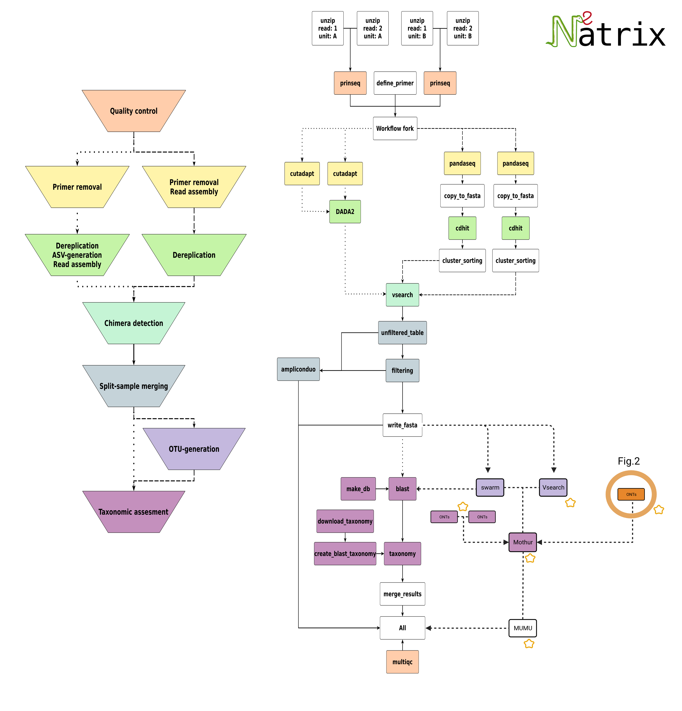
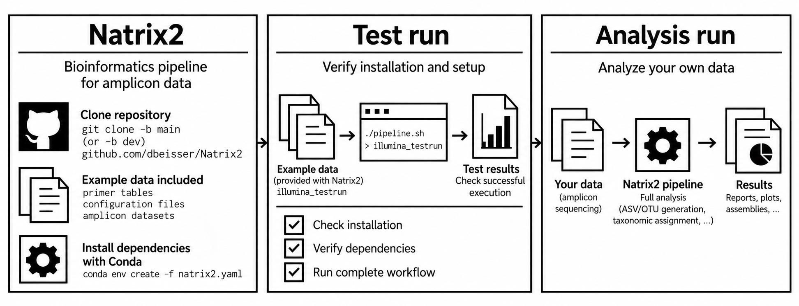
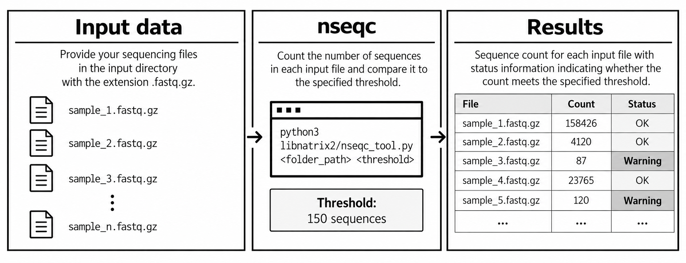
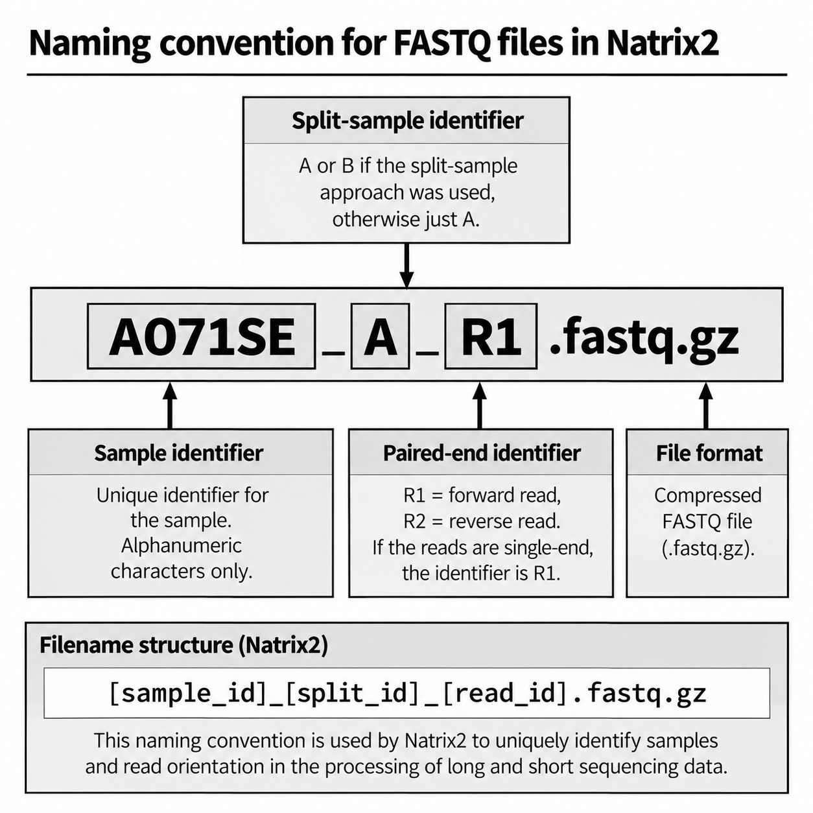
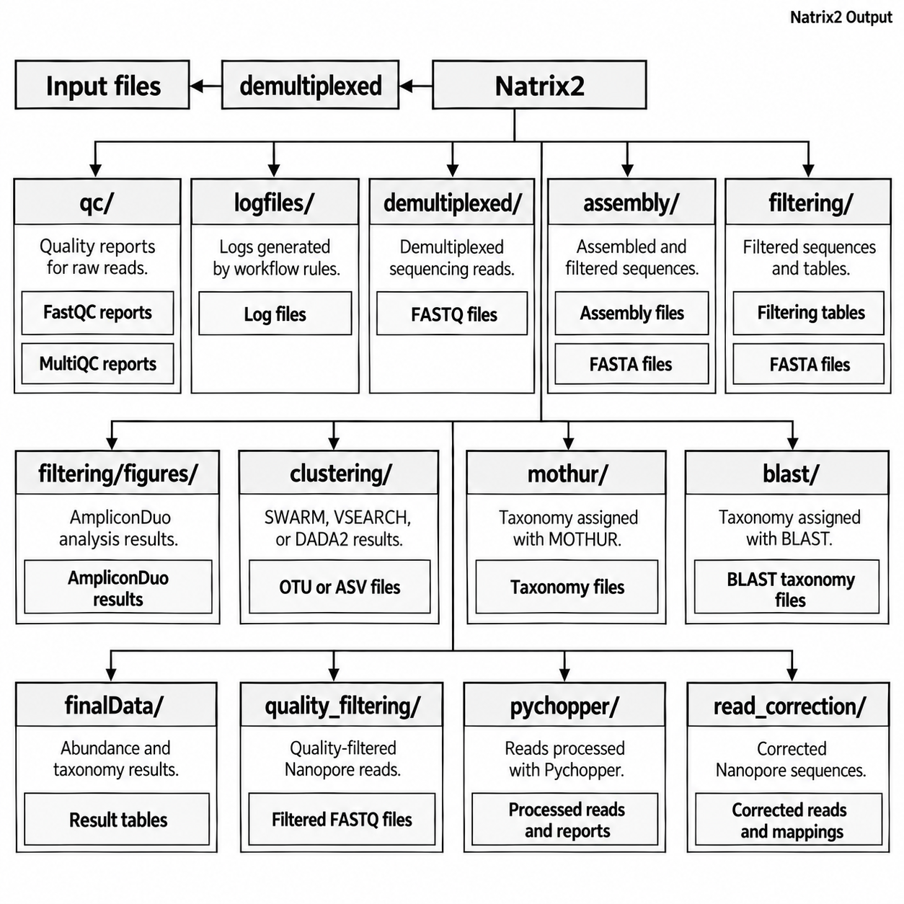
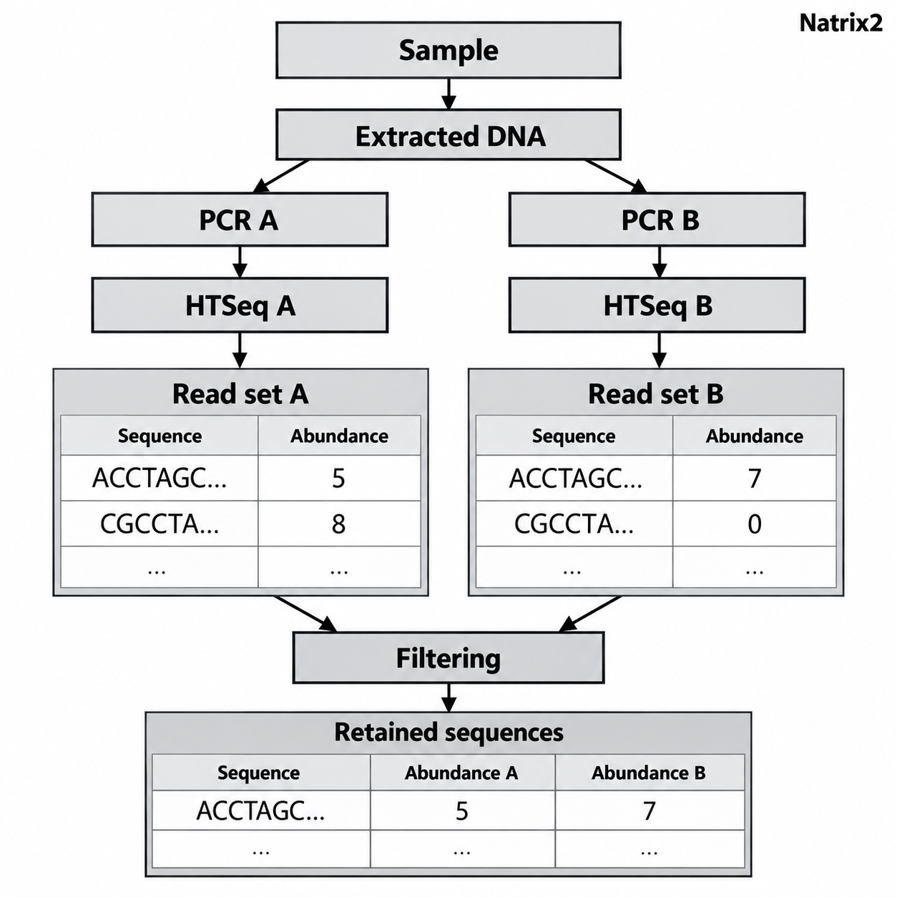
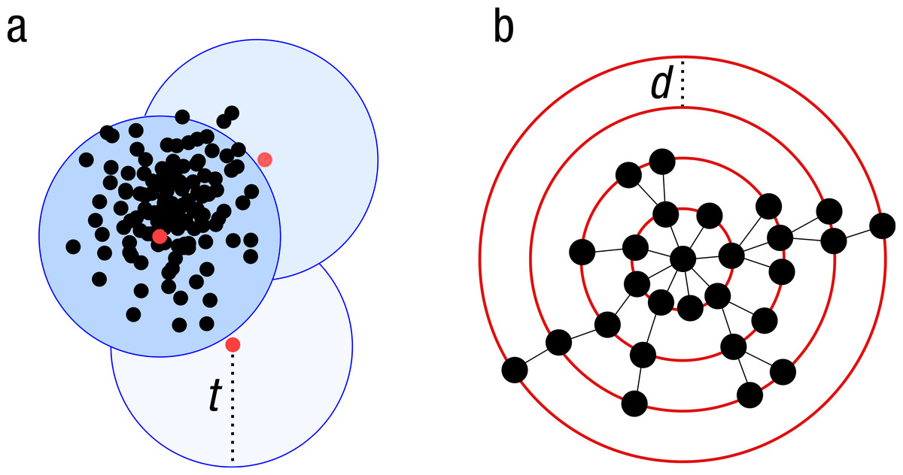

<p align="center">

</p>

**Natrix2 — Pipeline for Amplicon Data — [Citation](#citation)**

---

### About Natrix2

Natrix2 is an open-source bioinformatics pipeline for the preprocessing of long and short raw sequencing data. The need for a scalable, reproducible workflow for the processing of environmental amplicon data led to the development of Natrix2. It is divided into quality assessment, dereplication, chimera detection, split-sample merging, ASV or OTU generation, and taxonomic assessment. The pipeline is written in [Snakemake](https://snakemake.readthedocs.io) (Köster and Rahmann 2018), a workflow management engine for the development of data analysis workflows. Snakemake ensures the reproducibility of a workflow by automatically deploying dependencies of workflow steps (rules) and scales seamlessly to different computing environments such as servers, computer clusters, or cloud services. While Natrix2 was only tested with 16S and 18S amplicon data, it should also work for other kinds of sequencing data. The pipeline contains separate rules for each step of the pipeline, and each rule that has additional dependencies has a separate [Conda](https://conda.io/) environment that will be automatically created when starting the pipeline for the first time. The encapsulation of rules and their dependencies allows for hassle-free sharing of rules between workflows.

---

### Branch Selection

**Branches: [main](https://github.com/dbeisser/Natrix2/tree/main) — [dev](https://github.com/dbeisser/Natrix2/tree/dev)** — To access the latest features and ongoing developments, it is recommended to use the dev branch of Natrix2, which contains recent updates and patches not yet available in the main branch. The main branch represents the stable version of the pipeline, providing validated and tested code suitable for routine analyses and reproducible workflows, while the dev branch is intended for testing and early access to new features.

---

### Natrix2 Modules

Natrix2 consists of several interconnected modules covering the main steps of amplicon data processing. The available modules provide dedicated workflows for Illumina and Nanopore sequencing data.


**Figure 1:** DAG of the Natrix2 workflow: Schematic representation of the Natrix2 workflow. The processing of two split samples using AmpliconDuo is depicted. The color scheme represents the main steps, dashed lines outline the OTU variant, and dotted lines outline the ASV variant of the workflow. Stars depict updates to the original Natrix workflow. Details on the ONT part are depicted in Figure 2.


**Figure 2:** Schematic diagram of processing Nanopore reads with Natrix2 for OTU generation and taxonomic assignment. The color scheme represents the main steps of this variant of the workflow.

---

# Table of contents

1. [Dependencies](#dependencies)
2. [Installation](#installation)
3. [Sequence Count](#sequence-count)
4. [Tutorial Natrix2](#tutorial-natrix2)
5. [Cluster Execution](#cluster-execution)
6. [Output Files](#output-files)
7. [Workflow](#workflow)
8. [Primertable](#primertable)
9. [Configuration](#configuration)
10. [References](#references)
11. [Citation](#citation)
12. [Troubleshooting](#troubleshooting)

---

# Dependencies

**We strongly recommend running Natrix2 on a Linux-based system, as most bioinformatics tools and dependencies are developed and tested in Unix-like environments.**

- [Linux](https://ubuntu.com/) – recommended operating system   
  The pipeline was developed and tested on the Ubuntu distribution. Linux provides a stable and high-performance environment for computationally intensive bioinformatics workflows and ensures compatibility with most scientific software.

- [Snakemake](https://snakemake.readthedocs.io/en/stable/) – workflow management system    
  Workflow management system for defining, organizing, and executing reproducible and scalable data analyses. Workflows are described in a readable, Python-based language and executed with automatic handling of dependencies, parallelization, and reproducibility across different computing environments.

- [Conda](https://conda.io/en/latest/index.html) – package and environment manager  
  Cross-platform package and environment manager used to install all required software in isolated, reproducible environments. Conda ensures that the correct versions of all dependencies are used and allows easy sharing of the computational environment.

- [GNU Screen](https://www.gnu.org/software/screen/) – terminal multiplexer  
  Allows long-running pipeline executions to continue in detached sessions, preventing termination if the terminal connection is interrupted (e.g., SSH disconnects). GNU Screen is widely available on Linux systems.

  Alternatively, [tmux](https://github.com/tmux/tmux) can be used for the same purpose.

  Installation example (Debian/Ubuntu):

  ```bash
  # Install GNU Screen
  apt-get install screen
  ```

Using a terminal multiplexer is strongly recommended for running Natrix2, especially for long analyses on remote systems. It allows the workflow to continue running if the remote connection is interrupted, helping to ensure stable and uninterrupted execution.

---

# Installation

Conda can be installed via the [Anaconda](https://www.anaconda.com/) or [Miniconda](https://conda.io/en/latest/miniconda.html) platforms, with Miniconda3 being recommended for most users; on Linux systems, it can be obtained using:

```shell
# Download Miniconda3 installer
wget https://repo.anaconda.com/miniconda/Miniconda3-latest-Linux-x86_64.sh
```

```shell
# Run Miniconda3 installer
bash Miniconda3-latest-Linux-x86_64.sh
```

Dependencies will be automatically installed using Conda environments and can be found in the corresponding `environment` files in the `envs` folder and the `natrix2.yaml` file in the root directory of the pipeline.

**Important:** After setting up your `natrix2.yaml` environment, make sure to check the [Sequence Count](#sequence-count) section before starting the workflow. To install Natrix2, you need the open-source package management system Conda and, if you want to run Natrix2 using the accompanying `pipeline.sh` script, GNU Screen. After cloning this repository to a folder of your choice, it is recommended to create a general Natrix2 Conda environment using the provided `natrix2.yaml` file; from the main folder of the cloned repository, run the following command:

```shell
# Create the Natrix2 Conda environment
conda env create -f natrix2.yaml
```

## Test run with Natrix2

**Important:** Before starting your own analysis, it is recommended to perform a test run to verify that Natrix2 and all required dependencies are installed and configured correctly. The test run provides a simple way to check whether the complete workflow can be executed successfully and helps identify potential installation or configuration issues before processing your own amplicon sequencing data.


**Figure 3:** Schematic overview of the Natrix2 workflow, illustrating the test run used to verify the installation and dependencies before performing a full analysis of user-provided amplicon sequencing data.

---

Natrix2 includes example [primertables](#primertable) (`/primer_table`), [configuration files](#configuration) (`/config_presets`), and amplicon datasets (`/input_data`). To test Natrix2 with the provided example data, start the pipeline launcher and select the available test run (`illumina_testrun`):

```shell
# Launch Natrix2 using pipeline.sh
$ ./pipeline.sh

# Pipeline launcher output
Natrix2 Pipeline Launcher
Exit launcher: enter 'exit' or 'quit'
Enter config:
Project:  your_config.yaml (root directory)
Test run: illumina_testrun (example config)

# Run Illumina test
$ > illumina_testrun
```

## Managing GNU Screen sessions

When Natrix2 is launched using `pipeline.sh`, the pipeline starts a GNU Screen session using the project name (e.g., `example_data`) as the session name. This allows the workflow to continue running in the background while the required dependencies for individual workflow rules are prepared automatically.

Use the following commands to manage or reattach to an active Screen session:

```shell
# Manage Screen sessions
screen -ls                    # List active Screen sessions
screen -r                     # Reattach to the most recent session
screen -r <session_name>      # Reattach to a specific session
screen -d -r <session_name>   # Force reattach to a session
```

Basic key bindings inside a Screen session:

```text
Ctrl+a, d    # Detach from the current session
Ctrl+a, k    # Terminate the current session
```

**Important:** Make sure that the Natrix2 Conda environment `natrix2` is activated when managing or reattaching to Screen sessions. This ensures that the required Natrix2 commands and dependencies are available.

---

# Sequence Count

Before starting the workflow, it is recommended to verify the number of sequences in your input data. All provided sequence files (`*.fastq`, `*.fastq.gz`) should contain a sufficient number of sequences to ensure proper workflow execution. Empirical observations indicate that issues can occur when the sequence count falls below 150 sequences per input file. Checking the input data beforehand can therefore help identify potentially problematic samples and prevent unnecessary workflow failures. For this purpose, Natrix2 provides the `nseqc` tool (nucleotide sequence counter) to analyze the sequence count of each input file before starting the workflow.

- **Important:** A minimum threshold of `150` sequences per input file is recommended.  
  After validating your input data, the workflow can be started as usual.

The tool compares the specified threshold with the sequence count of each input file. If the sequence count falls below the defined threshold, a warning is displayed. Affected files should be removed from the input directory before starting the workflow to ensure proper execution.


**Figure 4:** Schematic overview of the nseqc tool, illustrating the sequence count check used to identify input files below the specified threshold before performing a full analysis of user-provided amplicon sequencing data.

## Using the nseqc Tool

Navigate to the Natrix2 main directory and run the following command:

```shell
# Check sequence counts in FASTQ files
python3 libnatrix2/nseqc_tool.py <folder_path> <threshold>

# Example: 16S Prokaryote test data (A071SE)
python3 libnatrix2/nseqc_tool.py input_data/illumina/16S_Prok_Samples/A071SE 150
```

---

# Tutorial Natrix2

This tutorial provides a step-by-step guide for preparing input data and running Natrix2. It covers the required file naming conventions, input structure, and configuration settings for successful workflow execution. The following sections explain how to organize sequencing data, prepare the required metadata files, configure the workflow, and start the pipeline using predefined or custom configurations.

**FASTQ files must follow a specific naming convention:**

<p align="center">

</p>

**Figure 5:** Naming convention for FASTQ files.

```shell
# sampleID, A/B, R1/R2
sample_unit_direction.fastq.gz
```

with:

- **samplename**: sample identifier; use only alphanumeric characters (required).  
- **unit**: split-sample identifier; use **A** if not applicable (required).  
- **direction**: read orientation; use **R1** for single-end data (required).  

A dataset should look like this (two samples, paired-end, no split-sample approach):

```shell
S2016RU_A_R1.fastq.gz  # S2016RU, A, R1
S2016RU_A_R2.fastq.gz  # S2016RU, A, R2
S2016BY_A_R1.fastq.gz  # S2016BY, A, R1
S2016BY_A_R2.fastq.gz  # S2016BY, A, R2
```

In addition to the FASTQ files generated during sequencing, Natrix2 requires a [primertable](#primertable) containing the sample names and, if applicable, the length of poly-N tails, primer sequences, and barcodes for each sample and read direction. Except for the sample names, all other information may be omitted if the data has already been preprocessed or does not contain the corresponding subsequences. Natrix2 also requires a YAML [configuration](#configuration) file that defines the parameters used by the pipeline.

The primertable, configuration file, and FASTQ folder must be located in the root directory of the pipeline and share the same project name (`project.csv`, `project.yaml`, and the corresponding `project` folder). This naming scheme ensures that all required files are correctly assigned to the respective project during workflow execution. The `filename` entry in the configuration file must also match the project name to ensure that Natrix2 can correctly identify and process the input data.

## Running Natrix2 using `pipeline.sh`

Once everything is configured correctly, Natrix2 can be started using the `pipeline.sh` launcher. The launcher allows you to select a project configuration from the root directory or start one of the provided test runs.

```shell
# Launch Natrix2 using pipeline.sh
$ ./pipeline.sh

# Pipeline launcher output
Natrix2 Pipeline Launcher
Exit launcher: enter 'exit' or 'quit'
Enter config:
Project:  your_config.yaml (root directory)
Test run: illumina_testrun (example config)

# Run config from root directory
$ > illumina_otu_swarm_mumu_mothur_pr2.yaml
```

Alternatively, run a config from `config_presets`:

```shell
# Run config from config_presets directory
$ > config_presets/...
```

After selecting a configuration, Natrix2 starts the workflow using the specified project settings and processes the corresponding input data. Required workflow dependencies are prepared automatically, and individual processing steps are executed according to the selected configuration. If the workflow is interrupted, it can be restarted using the same configuration to continue from previously completed steps.

## Running Natrix2 Manually

To run the preparation script and Snakemake manually, first activate the Natrix2 Conda environment:

```shell
# Activate the Natrix2 Conda environment
conda activate natrix2
```

Next, run the preparation script using your project configuration:

```shell
# Generate the units.tsv file required by Natrix2
python3 create_dataframe.py <project>.yaml
```

Start the Natrix2 workflow using Snakemake:

```shell
# Run Natrix2
snakemake --use-conda --configfile <project>.yaml --cores <cores>
```

Here, `<project>` refers to the project name and `<cores>` specifies the number of CPU cores allocated to Natrix2. If the workflow is interrupted or terminates due to an error, running the same command again will resume execution from the last completed workflow steps.

**Optional:** Verify the workflow setup with a Snakemake dry run using `-n`:

```shell
# Perform a dry run
snakemake --use-conda --configfile <project>.yaml --cores <cores> -n
```

The dry run checks the workflow configuration and determines which processing steps would be executed without actually running them. This can be used to identify configuration issues, missing input files, or unresolved dependencies before starting the full Natrix2 workflow.

## Docker or Docker Compose

Detailed setup instructions are available in the [Docker manual](documentation/manuals/docker_manual.pdf).

### Docker Installation and Natrix2 Image

Natrix2 can be executed within a Docker container. Therefore, Docker must be installed on your system. If Docker is not yet installed, please refer to the [official Docker documentation](https://docs.docker.com/engine/install/) for installation instructions.

To verify that Docker has been installed correctly, run:

```bash
# Check Docker installation
docker --version
```

Download the latest Natrix2 image from [Docker Hub](https://hub.docker.com/r/dbeisser/natrix2):

```bash
# Download Natrix2 image
docker pull dbeisser/natrix2:latest
```

The Docker image provides a preconfigured Natrix2 environment with the required software and dependencies for running the workflow. Using the container ensures a consistent and reproducible setup across different systems without requiring the individual installation of workflow dependencies.

---

#### Environment Setup

**Step 1:**  
Before using Docker, create the following directories on your system: `input`, `output`, and `database`. These directories are required for organizing input data, storing analysis results, and managing reference databases.

**Step 2:**  
Copy the configuration file `config.yaml` and the primer table `primer.csv` into the `input` directory. Sample files can be stored in a separate subdirectory such as `input/samples` to keep the input data organized.

**Step 3:**  
Open the configuration file `config.yaml` with a text editor and adjust the parameters according to your analysis. Make sure to define the required number of CPU cores and the available working memory (RAM).

**Step 4:**  
Define the required paths in `config.yaml` so that Natrix2 can locate the input data correctly. If your samples are stored in a subdirectory, specify the corresponding path (e.g., `filename: input/samples`).

---

**Example folder structure:**

```text
./natrix2/             # Main project directory
├── input/             # Files required for analysis
│   ├── samples/       # Input FASTQ files
│   ├── config.yaml    # Configuration file
│   └── primer.csv     # Primer table
├── output/            # Analysis output
│   └── results/       # Result files
└── database/          # Reference databases
```

#### Example `config.yaml`

```yaml
general:
    filename: input/samples       # Path to samples directory
    output_dir: output/results    # Path to results directory
    primertable: input/primer.csv # Path to primer table
    cores: 20                     # Number of CPU cores
    memory: 10000                 # RAM in megabytes
    # Further configuration options...
```

#### Create Docker Container

The Docker image includes all required environments, so they do not need to be downloaded during the initial workflow setup. To create the container and open a shell inside it, run:

```bash
# Replace `/your/local/` with the paths to your local Natrix2 directories
# Example: `/your/local/natrix2/input` to `/app/input`

docker run -it --label natrix2_container \
  -v /your/local/natrix2/input:/app/input \
  -v /your/local/natrix2/output:/app/output \
  -v /your/local/database:/app/database \
  dbeisser/natrix2:latest bash
```

The Docker container uses three main directories. The `input` directory contains the sample data, configuration file, and primer table. The `output` directory stores the workflow results and makes them accessible outside the container. The `database` directory stores reference databases such as SILVA or NCBI and is only required when BLAST is used for taxonomic assignment.

### Run Natrix2 in a Configured Docker Container

After starting the container and opening a shell, you can follow the instructions in [Running Natrix2 manually](#running-natrix2-manually) to start the workflow. Alternatively, you can use the `docker_pipeline.sh` script. Once the container is running, start the analysis by specifying the name of your configuration file located in the `input` directory.

```bash
# Replace `config` with the name of your configuration file
./docker_pipeline.sh config
```

To test the Docker container before running your own data, use the provided Nanopore test dataset. Start the test run using the `test_docker.yaml` configuration file:

```bash
# Start a test run using the provided sample data
./docker_pipeline.sh test_docker
```

### Use Docker Compose

Alternatively, Natrix2 can be started using Docker Compose from the root directory of the pipeline. Make sure that Docker Compose is installed on your system before proceeding. Verify the installation with:

```shell
# Check Docker Compose installation
docker-compose --version
```

All container-related directories are located under `/srv/docker/`.

---

**Step 1:**  
Copy your `samples/` directory, `config.yaml`, and `primer.csv` to
`/srv/docker/natrix2_cont_1/input/`. If the directory does not exist, create the
required folder structure first (see the recommended [Docker Compose folder
structure](#example-folder-structure-for-docker-compose) below). By default, the
container will wait until the input files are available.

#### Example Folder Structure for Docker Compose

```text
# Check the docker-compose.yaml file for additional configuration details.

# natrix2_cont_1 (container 1)
./srv/docker/natrix2_cont_1/
├── input/
│   ├── samples/       # Samples to be analyzed
│   ├── config.yaml    # Configuration file
│   └── primer.csv     # Primer table
├── output/
│   └── results/       # Analysis results
└── database/          # Reference databases

# Additional containers can be added if required
# e.g., natrix2_cont_2, natrix2_cont_3, ...
```

**Step 2:**  
Open your configuration file in a text editor and define all required directories
and file paths. Then adjust the parameters according to your analysis. Refer to the
[example configuration](#example-configyaml) above for guidance.

**Step 3:**  
Assign a project name to your configuration file, which will be used when starting
the container. To run multiple containers, specify a unique project name for each
container in the `docker-compose.yaml` file.

**Example:** Rename `config.yaml` to `project_name.yaml`.

**Step 4:**  
Once everything is configured correctly, start the container using the command
below. During the first launch, required reference databases will be downloaded to
`natrix2_cont_1/database/`, which may take some time.

---

**If multiple containers are required, create the corresponding directories as defined in `docker-compose.yaml`.**

```shell
# Start the container in detached mode
sudo PROJECT_NAME="project_name" docker compose up -d
```

If multiple containers are defined in `docker-compose.yaml`, all containers can be
started at once using the following command. Make sure that all paths and project
names are specified correctly to ensure successful workflow execution.

```shell
# Start all defined containers
sudo docker compose up
```

#### Build the Container Manually

If you prefer to build the Docker container directly from the repository, for example after modifying or updating the Natrix2 source code, you can build the Docker image locally using the following command:

```bash
# Build the Natrix2 Docker image locally
docker build -t natrix2 .
```

---

# Cluster Execution

Natrix2 can be run on different cluster systems using either Conda or the provided Docker container. This allows the workflow to efficiently use the computing resources currently available on the respective cluster system. For most common cluster computing environments, it is generally sufficient to add the `--cluster` option to the Snakemake command together with a job submission command such as `qsub`.

An example command is shown below:

```shell
# Run Natrix2 on a cluster using qsub
snakemake -s <path/to/Snakefile> --use-conda \
  --configfile <path/to/configfile.yaml> \
  --cluster "qsub -N <project_name> -S /bin/bash" \
  --jobs 100
```

Additional `qsub` arguments with brief explanations can be found in the
[qsub documentation](http://bioinformatics.mdc-berlin.de/intro2UnixandSGE/sun_grid_engine_for_beginners/how_to_submit_a_job_using_qsub.html).

To execute additional commands for each individual submitted job, the `--jobscript <path/to/jobscript.sh>` option can be used. An example job script that loads `.bashrc` and activates the Natrix2 Conda environment before execution is shown below:

```shell
#!/usr/bin/env bash

# Load user environment
source ~/.bashrc

# Activate Natrix2 Conda environment
conda activate natrix2

# Execute Snakemake job command
{exec_job}
```

Instead of passing cluster submission arguments directly to the Snakemake command, a Snakemake profile can be used to define cluster commands and resource settings. Profiles also allow specific rule-specific hardware requirements to be configured more precisely. For example, BLAST can benefit from more CPU cores, while other individual rules such as AmpliconDuo may require fewer resources.

Assigning appropriate resources to individual rules enables more efficient use of
cluster resources and can reduce queue waiting times. Profile configuration depends
on the available cluster software and hardware. Once a profile is configured,
Natrix2 can be executed with:

```shell
# Run Natrix2 using a Snakemake profile
snakemake -s <path/to/Snakefile> --profile myprofile
```

The Snakemake documentation provides detailed information and guidance on
[profile creation](https://snakemake.readthedocs.io/en/stable/executing/cli.html#profiles),
including the configuration of cluster-specific settings, resources, and execution
parameters. Additional examples and profiles for cluster systems and workload managers are available on the [Snakemake profiles GitHub page](https://github.com/snakemake-profiles/doc).

---

# Output Files

After the workflow has finished, all generated results are stored in the specified output directory. The directory structure and available output files depend on the selected sequencing data type, sequence representation, and analysis options. The main final results for downstream analyses are collected in the finalData/ directory.

<p align="center">

</p>

**Figure 6:** Overview of the main Natrix2 output files.

---

### Configuration-dependent output files

| Folder | File(s) | Description |
| --- | --- | --- |
| qc/ | FastQC and MultiQC reports | Quality reports for raw reads. |
| logfiles/ | Log files | Logs generated by workflow rules. |
| demultiplexed/ | FASTQ files | Demultiplexed sequencing reads. |
| assembly/ | Assembly and FASTA files | Assembled and filtered sequences. |
| filtering/ | Filtering tables and FASTA files | Filtered sequences and tables. |
| filtering/figures/ | AmpliconDuo results | AmpliconDuo analysis results. |
| clustering/ | OTU or ASV files | SWARM, VSEARCH, or DADA2 results. |
| mothur/ | Taxonomy files | Taxonomy assigned with MOTHUR. |
| blast/ | BLAST taxonomy files | Taxonomy assigned with BLAST. |
| finalData/ | full_table.csv | Abundance and taxonomy results. |
|  | OTU_table.csv | Final abundance table. |
|  | metadata_table.csv | Metadata for the abundance table. |
|  | full_table_mumu.csv | MUMU abundance and taxonomy results. |
|  | OTU_table_mumu.csv | Final MUMU abundance table. |
| quality_filtering/ | Filtered FASTQ files | Quality-filtered Nanopore reads. |
| pychopper/ | Processed reads and reports | Reads processed with Pychopper. |
| read_correction/ | Corrected reads and mappings | Corrected Nanopore sequences. |

**Table 1:** Natrix2 output files and directories.

---

# Workflow

## Initial Demultiplexing – Illumina

Demultiplexing refers to the sorting of sequencing reads according to their
associated barcode sequences. During this step, barcode information is used to
assign reads to their corresponding samples, allowing sequencing data from
multiple samples to be processed within the same sequencing run. The resulting
demultiplexed reads are stored in separate FASTQ files and used as input for
subsequent quality control and processing steps.

## Quality Control – Illumina

For quality control of Illumina sequencing data, Natrix2 uses FastQC
(Andrews 2010), MultiQC (Ewels et al. 2016), and PRINSEQ
(Schmieder and Edwards 2011). These tools are used to assess sequencing quality,
summarize quality metrics across samples, and remove sequences that do not meet
the quality requirements specified in the pipeline configuration. The resulting
quality-controlled reads are used for subsequent processing steps.

### FastQC – Quality Assessment

FastQC generates a quality report for each FASTQ file and provides information
on several characteristics of the sequencing reads. These include per-base and
average sequence quality based on Phred scores, GC content, overrepresented
sequences, adapter contamination, and k-mer composition. The resulting reports
provide an overview of sequencing quality and can be used to identify potential
quality problems before further processing.

### MultiQC – Quality Summary

MultiQC aggregates the individual FastQC reports into a single summary report,
allowing the quality metrics of all FASTQ files to be assessed together. This
provides an overview of sequencing quality across all samples and facilitates
the identification of individual files that differ from the overall dataset.
The combined report therefore simplifies the evaluation and comparison of
quality metrics across the sequencing run.

### PRINSEQ – Quality Filtering

PRINSEQ is used to filter sequencing reads according to their average sequence
quality. Reads with an average quality score below the threshold specified in
the pipeline configuration file are removed from further processing. This step
ensures that low-quality sequences are excluded from the dataset before
subsequent assembly, filtering, and clustering steps are performed within the
workflow.

## Read Assembly – Illumina

### Primer Definition

The `define_primer` rule specifies the subsequences that are removed during read
processing. These are defined by entries in the configuration file and a primer
table containing primer sequences, barcode sequences, and lengths of poly-N
regions. Subsequence removal can also be performed solely based on length using
an offset. This approach is useful when uncalled bases prevent proper matching
between primer table entries and sequencing reads.

### PANDAseq – Read Assembly and Subsequence Removal

For paired-end reads in the OTU workflow, PANDAseq (Masella et al. 2012) is used
to assemble overlapping forward and reverse reads while applying probabilistic
error correction. After assembly and trimming, sequences are removed if they
fall outside the configured length range, have an assembly quality score below
the specified threshold, or provide insufficient overlap between forward and
reverse reads. These thresholds can be adjusted in the configuration file.

For single-end reads, the undesired subsequences defined by the `define_primer`
rule, including poly-N regions, barcodes, and primers, are removed before
filtering. The resulting sequences are subsequently filtered according to the
minimum and maximum sequence length thresholds specified in the pipeline
configuration file. Sequences meeting the configured requirements are retained
and passed to the subsequent processing and clustering steps of the OTU
workflow for further sequence analysis.

### Cutadapt – Subsequence Removal

In the ASV workflow, Cutadapt (Martin 2011) is used to remove undesired
subsequences defined in the primer table from the sequencing reads. These
subsequences include regions that are not required for downstream sequence
analysis and therefore need to be removed before denoising. The resulting
processed reads are subsequently passed to DADA2 for quality-aware denoising
and generation of amplicon sequence variants.

### DADA2 – ASV Denoising

After subsequence removal, amplicon sequence variants (ASVs) are generated using
DADA2 (Callahan et al. 2016). DADA2 dereplicates the dataset and applies a
denoising algorithm that infers biological sequences based on sequence
composition, quality scores, abundance, and an Illumina error model. Following
ASV inference, forward and reverse reads with exact overlaps are assembled. The
resulting ASVs are stored as FASTA files for downstream analyses.

## Quality Filtering – Nanopore

For quality control and filtering of Nanopore sequencing data, Natrix2 uses
Chopper (De Coster and Rademakers 2023). Chopper processes the input reads
according to the quality requirements specified for the workflow and removes
reads that do not meet the configured criteria. The resulting quality-filtered
reads provide the input for subsequent read processing and correction steps
within the Nanopore workflow.

### Pychopper – Read Processing

Pychopper processes Oxford Nanopore reads by identifying their orientation and
reorienting reverse reads into the forward direction. During this processing,
sequencing adapters, barcodes, and primer sequences are removed from the reads.
This generates consistently oriented and processed sequences and prepares the
Nanopore reads for the subsequent read correction steps performed within the
Natrix2 workflow.

## Read Correction – Nanopore

Read correction is performed to improve the accuracy of processed Nanopore reads
before downstream analysis. Natrix2 combines sequence clustering, read mapping,
and consensus polishing to generate corrected representative sequences.
CD-HIT-EST is used for initial clustering, followed by mapping with Minimap and
consensus polishing with Racon and Medaka. The corrected sequences are then
passed to subsequent processing steps within the workflow.

### CD-HIT-EST – Sequence Clustering

CD-HIT-EST (Fu et al. 2012) clusters sequences that are identical or where one
sequence is a subsequence of another, a process referred to as dereplication.
The longest sequence is initially selected as a representative, and remaining
sequences are processed in descending order of length. Reads meeting the
configured sequence identity threshold are assigned to an existing
representative, while unmatched reads form new representative sequences.

The resulting clusters are mapped against the previously generated FASTA files
using Minimap (Li 2018). This mapping establishes the relationships between the
quality-filtered reads and the representative sequences generated during
clustering. These read-to-sequence relationships provide the alignments required
for subsequent consensus polishing and allow the representative sequences to be
refined using information from the corresponding Nanopore reads.

### Racon – Consensus Polishing

Racon is used to generate error-corrected consensus sequences from the clustered
Nanopore reads. Quality-filtered reads are aligned to the representative
sequences generated during clustering, and Racon uses these alignments to
perform distance-based consensus polishing. This process improves the consensus
sequence based on information from the corresponding reads. The resulting
polished sequences are subsequently passed to Medaka for additional sequence
correction.

### Medaka – Consensus Polishing

Medaka performs an additional polishing step to further improve the accuracy of
the Racon-corrected consensus sequences. The corresponding sequences are mapped
against the Racon-polished consensus sequences, and a neural network–based
approach is used to refine the sequence consensus. This provides an additional
level of error correction before the resulting sequences are passed to the
subsequent processing steps of the workflow.

## Similarity Clustering – OTU

### FASTQ to FASTA Conversion

In the OTU workflow, the `copy_to_fasta` rule converts FASTQ files into FASTA
format before similarity clustering. This reduces disk usage by removing quality
information that is no longer required at this stage and provides the
FASTA-formatted sequence data required by CD-HIT-EST. The resulting FASTA files
are subsequently used as input for the initial similarity clustering step of
the workflow.

### CD-HIT-EST – Similarity Clustering

CD-HIT-EST (Fu et al. 2012) is used to cluster sequences based on sequence
identity or subsequence relationships. The longest sequence is selected as the
initial representative, and remaining sequences are processed in descending
order of length. Sequences meeting the identity threshold specified in the
configuration file are assigned to existing clusters, whereas unmatched
sequences are retained as new representative sequences for subsequent
processing.

### Cluster Sorting

The `cluster_sorting` rule uses the output generated by the `cdhit` rule to
determine the number of sequences represented by each cluster. Representative
sequences are subsequently sorted in descending order according to cluster size.
In addition, the sequence headers are modified to provide the abundance
information required by the subsequent UCHIME-based chimera detection step of
the workflow.

## Chimera Detection

### VSEARCH – Chimera Detection

VSEARCH is an open-source alternative to the USEARCH toolkit that aims to
replicate the functionality of USEARCH algorithms, whose source code is not
publicly available and is often only briefly described (Rognes et al. 2016).
In Natrix2, the VSEARCH `uchime3_denovo` algorithm, hereafter referred to as
VSEARCH3, is used for the detection of chimeric sequences before subsequent
processing and OTU generation.

The UCHIME2 algorithm is described by Edgar (2016) as follows:

> "Given a query sequence *Q*, UCHIME2 uses the UCHIME algorithm to construct a model
> (*M*), then makes a multiple alignment of *Q* with the model and top hit (*T*, the
> most similar reference sequence). The following metrics are calculated from the
> alignment: number of differences d<sub>QT</sub> between Q and T and d<sub>QM</sub>
> between *Q* and *M*, the alignment score (*H*) using eq. 2 in R. C. Edgar et al.
> 2011. The fractional divergence with respect to the top hit is calculated as
> div<sub>T</sub> = (d<sub>QT</sub> − d<sub>QM</sub>)/|Q|. If divT is large, the model
> is a much better match than the top hit and the query is more likely to be
> chimeric, and conversely if div<sub>T</sub> is small, the model is more likely to
> be a fake."

The main difference between the UCHIME2 and UCHIME3 algorithms lies in the
abundance criteria used to select potential parent sequences. In UCHIME3, a
potential parent must have at least sixteen times the abundance of the query
sequence, whereas UCHIME2 requires only a twofold abundance. These abundance
requirements influence which sequences can be considered potential parents
during the identification of chimeric sequences.

## Table Creation and Filtering

### Merging FASTA Files

For downstream processing, the `unfiltered_table` rule merges all FASTA files
into a single nested dictionary. Each sequence serves as a key associated with
the samples or split samples in which it occurs and their respective sequence
abundances. The resulting data structure is temporarily stored in JSON format
for intermediate processing and additionally exported as a comma-separated
table for subsequent analyses.

### Sequence Filtering

During filtering, sequences that do not occur in both split samples of at least
one sample are removed. For single-sample data, an abundance cutoff specified
in the configuration file is applied instead, removing sequences with abundances
less than or equal to the defined threshold. Both retained and filtered-out
sequences are subsequently exported as comma-separated tables for downstream
processing and inspection.

### Conversion to FASTA

The filtered sequence table is converted back into FASTA format using the
`write_fasta` rule. This conversion is required because the subsequent Swarm
clustering step expects FASTA-formatted sequence input. The resulting FASTA file
contains the sequences retained during filtering and therefore provides the
input dataset used for subsequent OTU generation within the Natrix2 workflow.

## AmpliconDuo and Split-Sample Filtering

The pipeline supports both single-sample and split-sample FASTQ amplicon data.
The split-sample protocol (Lange et al. 2015) aims to reduce sequences
originating from PCR or sequencing errors without relying on stringent abundance
cutoffs, which may remove rare but biologically relevant sequences. Extracted
DNA from a single sample is divided into two split samples that are independently
amplified and sequenced.

Sequences that do not occur in both split samples are considered erroneous and
are filtered out. This approach assumes that sequences generated by PCR or
sequencing errors are unlikely to occur independently in both experimental
branches. Consequently, sequences occurring consistently in both split samples
can be retained without relying exclusively on their abundance. A schematic
overview of the split-sample approach is shown below.

<p align="center">

</p>

**Figure 7:** Schematic representation of the split-sample approach. Extracted DNA from a single environmental sample is split and separately amplified and sequenced. The filtering rule compares the resulting read sets between the two split samples and filters out all sequences that do not occur in both. Image adapted from Lange et al. (2015).

The initial proposal for the split-sample approach by Dr. Lange was accompanied
by the release of the R package [AmpliconDuo](https://cran.r-project.org/web/packages/AmpliconDuo/index.html)
for statistical analysis of amplicon data generated using this approach.
AmpliconDuo uses Fisher's exact test to identify significantly deviating read
numbers between the two experimental branches, A and B, originating from the
same sample S.

To quantify discordance between both branches, the read-weighted discordance
∆<sup>r</sup><sub>Sθ</sub>, weighted by the average read number of each sequence
in both branches, and the unweighted discordance ∆<sup>u</sup><sub>Sθ</sub> are
calculated. If ∆<sup>u</sup><sub>Sθ</sub> = 0, both branches contain the same
set of sequences, whereas ∆<sup>r</sup><sub>Sθ</sub> = 0 indicates that the read
numbers are within the error margin defined by the selected false discovery rate.

The resulting discordance values are plotted for visualization and written to
an R data file for subsequent analysis. This allows sequences with significantly
deviating read abundances between the two experimental branches to be identified
and filtered. The AmpliconDuo analysis therefore provides an additional
statistical assessment of the agreement between split samples and complements
the sequence-based filtering performed within the Natrix2 workflow.

## OTU Generation

### SWARM – OTU Clustering

OTUs are generated using the Swarm clustering algorithm (Mahé et al. 2015).
Swarm clusters sequences using an iterative approach based on a local clustering
threshold. Initially, the first amplicon is selected as an OTU seed, and
amplicons differing from this seed by no more than the configured threshold are
added as subseeds. By default, the local threshold corresponds to one nucleotide
difference between sequences.

In subsequent iterations, amplicons whose nucleotide difference from any
existing subseed does not exceed the threshold are added to the OTU. This
process continues until no additional amplicons can be recruited, after which
the OTU is closed and a new OTU is initialized. The iterative procedure avoids
the use of a single global similarity threshold around a predefined sequence
centroid.

This approach also reduces the dependency on sequence input order associated
with greedy clustering methods. Swarm produces a star-shaped minimum spanning
tree that is typically centered on a highly abundant amplicon. In contrast to
greedy clustering based on a global threshold, Swarm iteratively extends each
OTU using a local clustering threshold, as illustrated in Figure 8.

<p align="center">

</p>

**Figure 8:** Schematic representation of the greedy clustering approach and the iterative Swarm approach. The greedy approach (a), which uses a global clustering threshold *t* and input order–dependent centroid selection, can result in closely related amplicons being assigned to different OTUs. In contrast, the iterative Swarm approach (b), which applies a local threshold *d*, forms OTUs containing only closely related amplicons with a centroid that emerges naturally during the iterative clustering process. Image from Mahé et al. (2015).

### VSEARCH – OTU Clustering

OTUs can alternatively be generated using the de novo clustering algorithm
provided by VSEARCH (Rognes et al. 2016). This algorithm follows a greedy,
centroid-based approach using a configurable sequence similarity threshold
defined in the pipeline configuration file. Input sequences are processed
sequentially and compared against an initially empty database of centroid
sequences to determine their assignment to individual OTUs.

Each query sequence is assigned to the first centroid that meets or exceeds the
specified similarity threshold. If no suitable centroid is found, the query
sequence is designated as a new centroid. This provides an alternative to the
iterative local clustering strategy used by Swarm and allows the desired OTU
clustering method to be selected through the Natrix2 configuration.

## Sequence Comparison and Taxonomic Assignment

Assigning taxonomic information to OTUs or ASVs is an important step in the
analysis of environmental amplicon data because taxonomic identities help
characterize the organisms represented in the sampled environment. To identify
sequences similar to each OTU or ASV representative, BLAST (Basic Local
Alignment Search Tool; Altschul et al. 1990) is used to search against the SILVA
reference database (Pruesse et al. 2007).

### SILVA – Reference Database

The SILVA database contains curated and aligned rRNA sequence data generated
through a multi-step curation process. While it provides extensive coverage of
prokaryotic rRNA sequences, its representation of microbial eukaryotes is more
limited. If the database is not available locally, the required files are
automatically downloaded and the database is built using the `make_silva_db`
rule. Sequence comparison is subsequently performed using BLASTn.

The tab-separated output of the BLAST rule contains the following information
for each representative sequence, provided that the BLASTn results meet the
criteria specified in the [configuration](#configuration) file:

| Column Nr. | Column Name | Description |
|------------|-------------|-------------|
| 1. | qseqid | Query sequence identification |
| 2. | qlen | Length of the query sequence |
| 3. | length | Length of the alignment |
| 4. | pident | Percentage of identical matches |
| 5. | mismatch | Number of mismatches |
| 6. | qstart | Start of the alignment in the query sequence |
| 7. | qend | End of the alignment in the query sequence |
| 8. | sstart | Start of the alignment in the target sequence |
| 9. | send | End of the alignment in the target sequence |
| 10. | gaps | Number of gaps |
| 11. | evalue | E-value |
| 12. | stitle | Title (taxonomy) of the target sequence |

**Table 2:** BLAST output column descriptions.

## Merging of Results

The outputs generated by the `write_fasta`, `swarm`, and `blast` rules are
merged into a single comma-separated table using the `merge_results` rule. For
each representative sequence, the resulting table contains the sequence
identifier, nucleotide sequence, abundance in each sample, and total abundance
across all samples. If a BLAST hit is available, the corresponding annotation
fields listed in Table 2 are additionally included in the final table.

---

# Primertable

The primertable contains the primer, barcode, and poly-N information required
for sequence processing within Natrix2. It must be provided as a CSV file named
`primer.csv`, with each row representing a sample and the corresponding forward
and reverse sequence information. Empty fields can be used when no barcode or
poly-N sequence is present. The sequence information is used to identify
regions required during read processing. Examples from the Natrix2 test datasets
with and without the split-sample approach are shown below.

## With Split-Sample Approach

Example from the Natrix2 test dataset `A071SE_16S_Illumina.csv`.

| Probe | poly_N | Barcode_forward | specific_forward_primer | poly_N_rev | Barcode_reverse | specific_reverse_primer |
|-------|--------|-----------------|-------------------------|------------|-----------------|-------------------------|
| A071SE_A | NNNNN | TGATAGAGGGAT | GGCGVACGGGTGMGTAA | NNN | | TTACCGCGGCKGCTGGCAC |
| A071SE_B | NNNNNN | GTAACAAGTGAG | GGCGVACGGGTGMGTAA | NNNN | | TTACCGCGGCKGCTGGCAC |

**Table 3:** Example primertable using the split-sample approach.

## Without Split-Sample Approach

Example from the Natrix2 test dataset `16S_Cyprus_Nanopore.csv`.

| Probe | poly_N | Barcode_forward | specific_forward_primer | poly_N_rev | Barcode_reverse | specific_reverse_primer |
|-------|--------|-----------------|-------------------------|------------|-----------------|-------------------------|
| 1Barcode_A | | CACAAAGACACCGACAACTTTCTT | AGAGTTTGATCMGGCT | | AAGAAAGTTGTCGGTGTCTTTGTG | CGGYTACCTTGTTACGACTT |
| 2Barcode_A | | ACAGACGACTACAAACGGAATCGA | AGAGTTTGATCMGGCT | | TCGATTCCGTTTGTAGTCGTCTGT | CGGYTACCTTGTTACGACTT |
| 3Barcode_A | | CCTGGTAACTGGGACACAAGACTC | AGAGTTTGATCMGGCT | | GAGTCTTGTGTCCCAGTTACCAGG | CGGYTACCTTGTTACGACTT |

**Table 4:** Example primertable without the split-sample approach.

---

# Configuration

The Natrix2 workflow is configured using a YAML file that defines the input
data, computational resources, processing options, filtering parameters, and
taxonomic classification settings. The required parameter values depend on the
sequencing platform and selected analysis strategy. The configuration therefore
allows the workflow to be adapted to different sequencing datasets and analysis
requirements.

The table below provides only a **selection of important configuration parameters**
and does not represent the complete Natrix2 configuration. It is intended as a
quick reference for parameters that are particularly relevant when setting up
an analysis. All available parameters, supported values, recommendations, and
usage examples are documented directly in the configuration file. The complete
[Illumina test-run configuration](config_presets/illumina_testrun.yaml) can be
used as a reference when preparing a configuration for a new analysis.

| Option | Example (illumina_testrun.yaml) | Description |
|--------|---------------------------------|-------------|
| filename | input_data/illumina/16S_Prok_Samples/A071SE | Input data directory. |
| output_dir | results_illumina_testrun | Output directory. |
| primertable | primer_table/A071SE_16S_Illumina.csv | Primer table. |
| cores | 20 | Available CPU cores. |
| memory | 10000 | Available memory in MB. |
| multiqc | TRUE | FastQC and MultiQC analysis. |
| seq_rep | OTU | Sequence representation. |
| nanopore | FALSE | Sequencing data type. |
| filter_method | split_sample | Sequence filtering method. |
| paired_End | TRUE | Paired-end sequencing data. |
| clustering | swarm | OTU clustering method. |
| vsearch_id | 0.97 | VSEARCH identity threshold. |
| mumu | TRUE | MUMU filtering. |
| mothur | TRUE | MOTHUR classification. |
| database | pr2 | MOTHUR reference database. |
| blast | FALSE | BLAST classification. |
| ident | 90.0 | Minimum BLAST identity. |
| evalue | 1e-20 | Maximum accepted E-value. |

**Table 5:** Selected Natrix2 configuration parameters.

**Supported reference databases:** Natrix2 currently supports PR2, Eukaryome,
ROD, SILVA, and UNITE as reference databases for taxonomic classification of
amplicon sequences. Additionally, NCBI databases are supported for taxonomic
assignment when using BLAST.

---

# References

- Köster, Johannes & Rahmann, Sven (2018). “Snakemake—a scalable bioinformatics workflow engine”. *Bioinformatics*, 34(20), pp. 3600–3602. https://doi.org/10.1093/bioinformatics/bty350
- Ewels, P. et al. (2016). “MultiQC: Summarizes analysis results for multiple tools and samples in a single report”. *Bioinformatics*, 32(19), pp. 3047–3048. https://doi.org/10.1093/bioinformatics/btw354
- Anaconda, Inc. (2012). *Conda: Package, dependency and environment management for any language.* https://docs.conda.io
- Van Rossum, G., & Drake, F. L. (2009). *Python 3 Reference Manual.* CreateSpace, Scotts Valley, CA. https://www.python.org
- R Core Team. (2023). *R: A Language and Environment for Statistical Computing.* R Foundation for Statistical Computing, Vienna, Austria. https://www.R-project.org
- Andrews, S. (2010). *FastQC: A quality control tool for high throughput sequence data.* https://www.bioinformatics.babraham.ac.uk/projects/fastqc/
- Martin, M. (2011). “Cutadapt removes adapter sequences from high-throughput sequencing reads”. *EMBnet.journal*, 17(1), p. 10. https://doi.org/10.14806/ej.17.1.200
- Schmieder, Robert & Edwards, Robert A. (2011). “Quality control and preprocessing of metagenomic datasets”. *Bioinformatics*, 27(6), pp. 863–864. https://doi.org/10.1093/bioinformatics/btr026
- Masella, Andre P. et al. (2012). “PANDAseq: paired-end assembler for Illumina sequences”. *BMC Bioinformatics*, 13(1), p. 31. https://doi.org/10.1186/1471-2105-13-31
- Callahan, B. J. et al. (2016). “DADA2: High-resolution sample inference from Illumina amplicon data”. *Nature Methods*, 13(7), pp. 581–583. https://doi.org/10.1038/nmeth.3869
- Fu, Limin et al. (2012). “CD-HIT: accelerated for clustering the next-generation sequencing data”. *Bioinformatics*, 28(23), pp. 3150–3152. https://doi.org/10.1093/bioinformatics/bts565
- Mahé, Frédéric et al. (2015). “Swarm v2: highly-scalable and high-resolution amplicon clustering”. *PeerJ*, 3. https://doi.org/10.7717/peerj.1420
- Li, Heng (2016). “Minimap and miniasm: fast mapping and de novo assembly for noisy long sequences”. *Bioinformatics*, 32(14), pp. 2103–2110. https://doi.org/10.1093/bioinformatics/btw152
- Edgar, Robert (2016). “UCHIME2: improved chimera prediction for amplicon sequencing”. *bioRxiv*. https://doi.org/10.1101/074252
- Rognes, Torbjørn et al. (2016). “VSEARCH: a versatile open source tool for metagenomics”. *PeerJ Preprints*. https://doi.org/10.7287/peerj.preprints.2409v1
- Pruesse, E. et al. (2007). “SILVA: a comprehensive online resource for quality checked and aligned ribosomal RNA sequence data compatible with ARB”. *Nucleic Acids Research*, 35(21), pp. 7188–7196. https://doi.org/10.1093/nar/gkm864
- Abarenkov, K. et al. (2023). “The UNITE database for molecular identification and taxonomic communication of fungi and other eukaryotes: sequences, taxa and classifications reconsidered”. *Nucleic Acids Research*. https://doi.org/10.1093/nar/gkad1039
- Altschul, Stephen F. et al. (1990). “Basic local alignment search tool”. *Journal of Molecular Biology*, 215(3), pp. 403–410. https://doi.org/10.1016/S0022-2836(05)80360-2
- Lange, Anja et al. (2015). “AmpliconDuo: A Split-Sample Filtering Protocol for High-Throughput Amplicon Sequencing of Microbial Communities”. *PLOS ONE*, 10(11). https://doi.org/10.1371/journal.pone.0141590
- De Coster, Wouter & Rademakers, Rosa (2023). “NanoPack2: population-scale evaluation of long-read sequencing data”. *Bioinformatics*, 39(5). https://doi.org/10.1093/bioinformatics/btad311

---

# Citation

**Natrix2 is based on the [Natrix](https://github.com/MW55/Natrix) pipeline — if you use this workflow, please cite**:

**Natrix2** – Improved amplicon workflow with novel Oxford Nanopore Technologies support and enhancements in clustering, classification and taxonomic databases. Deep, A.; Bludau, D.; Welzel, M.; Clemens, S.; Heider, D.; Boenigk, J.; and Beisser, D. Metabarcoding and Metagenomics, 7: e109389. Oct 2023. [https://mbmg.pensoft.net/article/109389/](https://mbmg.pensoft.net/article/109389/)

**Natrix**: a Snakemake-based workflow for processing, clustering, and taxonomically assigning amplicon sequencing reads. Welzel, M.; Lange, A.; Heider, D.; Schwarz, M.; Freisleben, B.; Jensen, M.; Boenigk, J.; and Beisser, D. BMC Bioinformatics, 21(1). Nov 2020. [https://bmcbioinformatics.biomedcentral.com/articles/10.1186/s12859-020-03852-4](https://bmcbioinformatics.biomedcentral.com/articles/10.1186/s12859-020-03852-4)

---

# Troubleshooting

Running complex bioinformatics workflows can sometimes lead to unexpected behavior or failed executions. Below is a collection of common issues that may occur during installation or pipeline runs, along with typical causes and hints for troubleshooting.

## Pipeline failure causes

- Negative controls or low-read samples. No sequences generated, missing outputs.  
- Empty or corrupted input files. These prevent the pipeline from generating expected results.  
- Sample names in `units.tsv` and `Primertable` must exactly match filenames.  
- Insufficient computational resources. Jobs may fail if memory, disk space, or CPU are exhausted.  
- Interrupted execution. Stopped workflows or failed jobs can lead to incomplete outputs.  
- Conda or dependency issues. Broken environments may cause rule failures.  
- File permission errors. Missing read/write access may prevent file creation.  

## Problems with installation

- Conda must be correctly installed and available in the PATH.  
- The pipeline requires a clean environment without leftovers from previous installations.  
- Snakemake environments must be valid; if broken, delete `.snakemake/conda/` and rerun.  
- The Snakemake version should match the one recommended in this repository.  
- Conflicts with other Python setups or package managers (pip, mamba) may cause errors.  

## Runtime or output issues
 
- Configuration mismatches. Incorrect settings in the config file can affect processing steps.
- Missing reference data. Ensure databases and indices are downloaded and correctly referenced.  
- Unexpected runtime errors. Crashes or empty outputs may indicate a bug or broken dependency.  
- Inconsistent results. Check log files and Snakemake reports for warnings or failed rules.  
