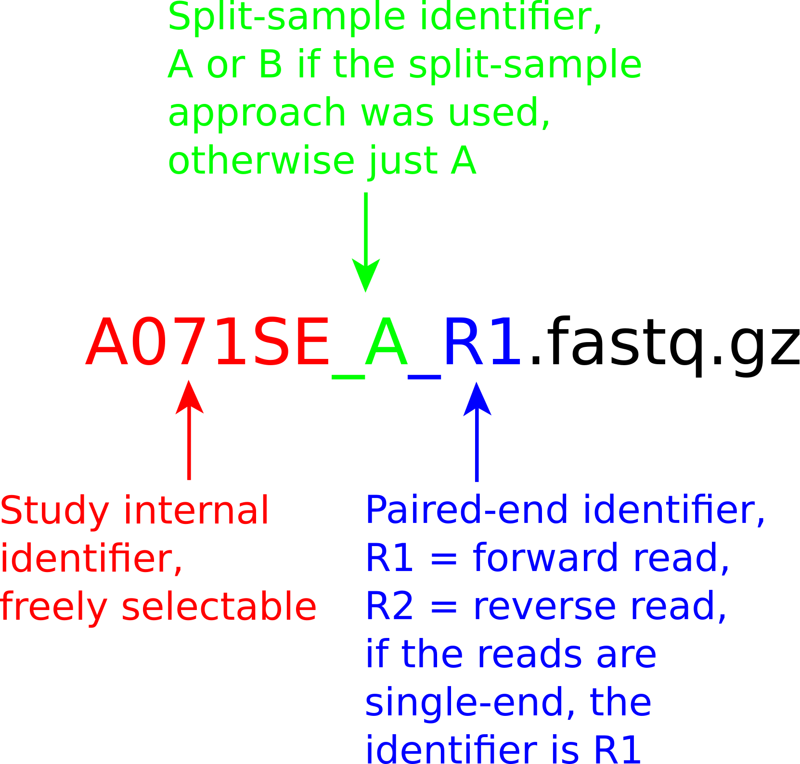

<p align="center">

</p>

---
Natrix is an open-source bioinformatics pipeline for the preprocessing of long and short raw sequencing data. The need for a scalable, reproducible workflow for the processing of environmental amplicon data led to the development of Natrix. It is divided into quality assessment, dereplication, chimera detection, split-sample merging, ASV or OTU generation, and taxonomic assessment. The pipeline is written in [Snakemake](https://snakemake.readthedocs.io) (Köster and Rahmann 2018), a workflow management engine for the development of data analysis workflows. Snakemake ensures the reproducibility of a workflow by automatically deploying dependencies of workflow steps (rules) and scales seamlessly to different computing environments such as servers, computer clusters, or cloud services. While Natrix was only tested with 16S and 18S amplicon data, it should also work for other kinds of sequencing data. The pipeline contains separate rules for each step of the pipeline, and each rule that has additional dependencies has a separate [Conda](https://conda.io/) environment that will be automatically created when starting the pipeline for the first time. The encapsulation of rules and their dependencies allows for hassle-free sharing of rules between workflows.


**Fig. 1**: DAG of the Natrix2 workflow: Schematic representation of the Natrix2 workflow. The processing of two split samples using AmpliconDuo is depicted. The color scheme represents the main steps, dashed lines outline the OTU variant, and dotted lines outline the ASV variant of the workflow. Stars depict updates to the original Natrix workflow. Details on the ONT part are depicted in Fig. 2.


**Fig. 2**: Schematic diagram of processing nanopore reads with Natrix2 for OTU generation and taxonomic assignment. The color scheme represents the main steps of this variant of the workflow.

# Table of contents
1. [Dependencies](#dependencies)
2. [Getting Started](#getting-started)
3. [Sequence Count](#sequence-count)
4. [Tutorial](#tutorial)
5. [Cluster execution](#cluster-execution)
6. [Output](#output)
7. [Steps of the Pipeline](#steps-of-the-pipeline)
8. [Example primertable](#example-primertable)
9. [Configfile](#configfile)
10. [Use dev-branch](#use-dev-branch)
11. [References](#references)

# Dependencies
* [Conda](https://conda.io/en/latest/index.html)
* [GNU screen](https://www.gnu.org/software/screen/) (optional)

Conda can be downloaded as part of the [Anaconda](https://www.anaconda.com/) or [Miniconda](https://conda.io/en/latest/miniconda.html) platforms (Python 3.7). 

We recommend installing Miniconda3.
Using Linux, you can get it with:

```shell
wget https://repo.anaconda.com/miniconda/Miniconda3-latest-Linux-x86_64.sh
```

```shell
bash Miniconda3-latest-Linux-x86_64.sh
```

GNU Screen can be found in the repositories of most Linux distributions:

* Debian/Ubuntu-based: ```apt-get install screen```
* RHEL-based: ```yum install screen```
* Arch-based: ```pacman -S screen```

All other dependencies will be automatically installed using Conda environments and can be found in the corresponding `environment.yaml` files in the **envs folder** and the `natrix.yaml` file in the root directory of the pipeline.

# Getting Started

**Important**, after you have set up your `natrix.yaml` environment, make sure you check the [Sequence Count](#sequence-count) section before you start the workflow.

---
To install Natrix, you'll need the open-source package management system [Conda](https://conda.io/en/latest/index.html) and, if you want to try Natrix using the accompanying `pipeline.sh` script, you'll need [GNU Screen](https://www.gnu.org/software/screen/). After cloning this repository to a folder of your choice, it is recommended to **create a general Natrix Conda environment** using the accompanying `natrix.yaml` file. In the main folder of the cloned repository, execute the following command:

```shell
conda env create --file=natrix.yaml
```

This will create a Conda environment containing all dependencies for Snakemake itself.

Natrix comes with an example [primertable](#example-primertable) (example_data.csv), [configfile](#configfile) (example_data.yaml), and an example amplicon dataset in the folder (/example_data).

To try out Natrix using the example data (Illumina_data or Nanopore_data), type in the following command:

Example: Using the `Illumina_swarm.yaml` configuration file.
```shell
$ ./pipeline.sh
Enter project name, for example Illumina_swarm:
$ Illumina_swarm
```

The pipeline will then start a screen session using the project name (here, **example_data**) as the session name and will begin downloading dependencies for the rules. To detach from the screen session, press **Ctrl+a, d** (first press Ctrl+a, then d). To reattach to a running screen session, type in:

```shell
screen -r
```

When the workflow has finished, you can press **Ctrl+a, k** (first press Ctrl+a, then k). This will end the screen session and any processes that are still running.

# Sequence Count

Before starting the workflow, you should check the number of sequences in your input files `*.fastq`, `*.fastq.gz`. If there are too few sequences, the workflow may abort. Experience has shown that the workflow aborts if the number of sequences is less than 150. To avoid this, you should analyze your data using the `tools/fastq_inspector.py` tool.

- Recommended threshold value: `150`

The tool compares your specified threshold value with the number of sequences in your files. If the number of sequences falls below the threshold value, a warning is issued. You should then move the affected files out of the folder to prevent errors.

### Instruction manual

First, go to the `tools` folder in your `main directory`. Then use the following command:

```shell
python3 fastq_inspector.py <folder_path> <threshold>
```

**Once you have checked your data with the tool, you can start the workflow as usual.**

# Tutorial

### Prerequisites: dataset, primertable, and configuration file

The FASTQ files need to follow a specific naming convention:

<p align="center">

</p>
<p><b>Fig. 3</b>: Specific naming for the FASTQ files</p>

```
samplename_unit_direction.fastq.gz
```

with:
* **samplename**: the name of the sample, without special characters.
* **unit**: identifier for [split-samples](#ampliconduo--split-sample-approach-illumina--and-nanopore-variant) (**A**, **B**). If the split-sample approach is not used, the unit identifier is simply **A**, but it still needs to be present.
* **direction**: identifier for forward (**R1**) and reverse (**R2**) reads of the same sample. If the reads are single-end, the direction identifier is **R1**; it still needs to be present.

A dataset should look like this (two samples, paired-end, no split-sample approach):

```
S2016RU_A_R1.fastq.gz
S2016RU_A_R2.fastq.gz
S2016BY_A_R1.fastq.gz
S2016BY_A_R2.fastq.gz
```

Besides the FASTQ data from the sequencing process, Natrix needs a [primertable](#example-primertable) containing the sample names and, if they exist in the data, the length of the poly-N tails, the sequence of the primers, and the barcodes used for each sample and direction. Except for the sample names, all other information can be omitted if the data was already preprocessed or did not contain the corresponding subsequences. Natrix also needs a [configuration](#configfile) file in YAML format, specifying parameter values for tools used in the pipeline.

The primertable, configfile, and the folder containing the FASTQ files all have to be in the root directory of the pipeline and have the same name (with their corresponding file extensions: `project.yaml`, `project.csv`, and the project folder containing the FASTQ files). The first [configfile](#configfile) entry `filename` also needs to be the name of the project.

---
### Running Natrix with the `pipeline.sh` script

If everything is configured correctly, you can start the pipeline by typing the following commands into your terminal emulator:

Example: Using the `Illumina_swarm.yaml` configuration file.
```shell
$ ./pipeline.sh
Enter project name, for example Illumina_swarm:
$ Illumina_swarm
```

The pipeline will then start a screen session using the project name as the session name and will begin downloading dependencies for the rules. To detach from the screen session, press **Ctrl+a, d** (first press Ctrl+a, then d). To reattach to a running screen session, type:

```shell
screen -r
```

When the workflow has finished, you can press **Ctrl+a, k** (first press Ctrl+a, then k). This will end the screen session and any processes that are still running.

---
### Running Natrix with Docker or docker-compose

#### Pulling the image from Dockerhub

Natrix2 can be run inside a Docker container. Therefore, Docker must be installed. Please refer to the [Docker website](https://docs.docker.com/engine/install/) to learn how to install Docker and set up an environment if you have not used it before.

Check whether you have installed Docker.

```bash
docker --version
```

To run the Docker container, download the pre-built container from [dockerhub](https://hub.docker.com/r/dbeisser/natrix2).

```bash
docker pull dbeisser/natrix2:latest
```

---
**Important before you continue with Docker!**

Before using Docker, please create the following folders on your system: `input`, `output`, `database`

Copy your configuration file (**project.yaml**) and the primer table (**project.csv**) that you want to use for your analysis into the `input` folder. You can also create a subfolder for your samples. Just not for your configuration file and primer table. These must be located in your `input` folder. It is important that you specify the folder path correctly in the configuration file.

Now you can open your configuration file (***project.yaml**) with any editor and adjust the parameters for your samples. Important! Set the parameters for your CPU cores and your working memory (RAM) before you start the analysis.

You must specify the folder path for your data in your configuration file so that it can be found. **Example**: `filename: input`. If you are using a subfolder, simply extend your folder path. `filename: input/subfolder` The same applies to your primer table.

**Example: Folder structure**

```bash
./project/
    ./project/input/
        ./project/input/samples # Samples to be analyzed
        ./project/input/project.yaml # Configuration file
        ./project/input/project.csv # Primer table
    ./project/output/
        ./project/output/project_results # Results of your analysis
    ./project/database/
```

**Example: Project.yaml**

```yaml
general:
    filename: input/samples # Folder with your samples
    output_dir: output/project_results # Results of your analysis
    primertable: input/project.csv # Specific primer table
    cores: 20 # Amount of cores
    memory: 10000 # Available RAM in Megabyte (MB)
    ...
```

---

The Docker container has all environments pre-installed, eliminating the need to download the environments during the first-time initialization of the workflow. To connect to the shell inside the Docker container, input the following command:

```bash
docker run -it --label natrix2_container -v </host/input>:/app/input -v </host/output>:/app/output -v </host/database>:/app/database dbeisser/natrix2:latest bash
```
**Functions of the respective folders**

`/host/input` is the full path to a local folder. The input folder contains your samples, configuration file (**project.yaml**) and your primer table (**project.csv**). Use the same project name for your configuration file and your primer table.

`/host/output` is the full path to a local folder where the output of the workflow should be saved so that the container can use it.

`/host/database` is the full path to a local folder in which you wish to install the database (**SILVA** or **NCBI**). This part is optional and only needed if you want to use BLAST for taxonomic assignment.

---

After you connect to the container shell, you can follow: [running Natrix manually](#running-natrix-manually)

You can also use the script `docker_pipeline.sh`. Once you have connected to the container and configured everything, you can start your analysis with the script. For example, if the configuration file `project.yaml` is in the input folder. 

```bash
./docker_pipeline.sh project # Use the file name of your config file
```

---

#### Use docker-compose

Alternatively, you can start the workflow using the docker-compose command in the root directory of the workflow. Please make sure that you have docker compose installed! First, check whether you have installed docker compose.

```shell
docker-compose --version # Check the version
```

All folders will be available at `/srv/docker/natrix2_smps1/`. Make sure to copy your `project_folder`, `project.yaml`, and `project.csv` files to `/srv/docker/natrix2_smps1/input/`. By default, the container will wait until the input files exist. On first launch, the container will download the required databases to `/srv/docker/natrix2_smps1/databases/`. This process might take a while.

You can also create several containers at the same time. Take a look at the file: `docker-compose.yaml`

```shell
# Optional: Parameter '-d' stands for “detached mode”
PROJECT_NAME="<project>" docker compose up (-d)
```

with **project** being the name of your project, e.g.:

```shell
# 'sudo' might be needed
sudo PROJECT_NAME="example_data" docker compose up
```

If you have defined several containers in the docker-compose file, you can start all containers with the command. It is important that you have entered everything correctly so that your analysis can run without errors.

```shell
# 'sudo' might be needed
sudo docker compose up
```

**Example: Folder structure for docker-compose**

```bash
# project_a; Container 1
./srv/docker/project_a/
    ./srv/docker/project_a/input/
        ./srv/docker/project_a/input/samples # Samples to be analyzed
        ./srv/docker/project_a/input/project.yaml # Configuration file
        ./srv/docker/project_a/input/project.csv # Primer table
    ./srv/docker/project_a/output/
        ./srv/docker/project_a/output/project_a_results # Results of your analysis
    ./srv/docker/project_a/database/

# OPTIONAL; If you use several containers, you can add another one.
# project_b; Container 2
./srv/docker/project_b/
    ./srv/docker/project_b/input/
        ./srv/docker/project_b/input/samples
        ./srv/docker/project_b/input/project.yaml
        ./srv/docker/project_b/input/project.csv
    ./srv/docker/project_b/output/
        ./srv/docker/project_b/output/project_a_results
    ./srv/docker/project_b/database/

# Container 3, Container 4 ...
```

#### Building the container yourself

If you prefer to build the Docker container yourself from the repository (for example, if you modified the source code of Natrix), the container can be built with the command:

```bash
docker build -t natrix2 .
```
---
### Running Natrix manually

If you prefer to run the preparation script and Snakemake manually, you need to start by activating the Snakemake environment:

```shell
conda activate natrix
```

Followed by running the preparation script, with project being the name of your project:

```shell
python3 create_dataframe.py <project>.yaml
```

This command will create the `units.tsv` file, containing the file information in a format that Natrix can use.

To start the main pipeline, type in:

```shell
snakemake --use-conda --configfile <project>.yaml --cores <cores>
```

with **project** being the name of your project and **cores** being the number of cores you want to allocate for Natrix to use.

If the pipeline prematurely terminates (either because of an error or by deliberately stopping it), running the command above again will restart the pipeline from the point it was terminated.

# Cluster execution

Natrix can be easily run on a cluster system using either Conda or the Docker container. Adding `--cluster` to the start command of Natrix, together with a command to submit jobs (e.g., qsub), is sufficient for most cluster computing environments. An example command would be:

```shell
snakemake -s <path/to/Snakefile> --use-conda --configfile <path/to/configfile.yaml> --cluster "qsub -N <project name> -S /bin/bash/" --jobs 100
```

Further qsub arguments, including brief explanations, can be found under [qsub arguments](http://bioinformatics.mdc-berlin.de/intro2UnixandSGE/sun_grid_engine_for_beginners/how_to_submit_a_job_using_qsub.html). For additional commands that should be executed for each job, the argument `--jobscript path/to/jobscript.sh` can be used. A simple job script that sources the `.bashrc` before the execution of each job and activates the Snakemake environment looks like this:

```shell
#!/usr/bin/env bash

source ~/.bashrc
conda activate natrix
{exec_job}
```

Instead of directly passing the cluster submission arguments to the Snakemake command, it is also possible to write a profile that contains cluster commands and arguments. The use of profiles allows the assignment of rule-specific hardware requirements. For example, the BLAST rule benefits from a large number of CPU cores, while other rules, like AmpliconDuo, do not. With profiles, rules could be assigned a low number of CPU cores by default, with rules like BLAST being assigned a larger number of cores. This allows for optimal usage of cluster resources and shorter waiting times. The creation of profiles is largely dependent on the software and hardware available on the cluster. With a profile, Natrix can simply be run with:

```shell
snakemake -s <path/to/Snakefile> --profile myprofile
```

The Snakemake documentation contains a tutorial for [profile creation](https://snakemake.readthedocs.io/en/stable/executing/cli.html#profiles), and the [Snakemake profiles GitHub page](https://github.com/snakemake-profiles/doc) contains example profiles for different cluster systems.

# Output

Once the workflow has been completed, all output files can be found in your output folder.

<p align="center">

</p>

**Fig. 4**: The output file hierarchy: Blue nodes represent folders, orange nodes represent files that are created in both variants of the workflow, green nodes represent files exclusive to the OTU variant, and purple nodes represent files exclusive to the ASV variant of the workflow.

| Folder                                | File(s)                    | Description                                                                                                              |
|---------------------------------------|----------------------------|--------------------------------------------------------------------------------------------------------------------------|
| qc                                    | FastQC reports             | Quality reports generated by the FastQC application.                                                                               |
|                                       | MultiQC report             | Aggregated FastQC reports in a single file.                                                                              |
| logs                                  | Logfiles                   | Logfiles of the different rules.                                                                                         |
| assembly (one folder for each sample) | sample_low_qual.fastq      | Sequences from the sample that did not pass the PRINSEQ quality filtering.                                                     |
|                                       | sample_assembled.fastq     | Sequences assembled with PANDAseq.                                                                                       |
|                                       | sample_singletons.fastq    | Sequences that could not be assembled.                                                                                   |
|                                       | sample.fasta               | FASTA file of the assembled sequences.                                                                                   |
|                                       | sample.dereplicated.fasta  | Dereplicated sequences from the sample.                                                                                        |
|                                       | sample_chimera.fasta       | Sequences from the sample that are thought to be of chimeric origin.                                                           |
| finalData                             | sample.nonchimera.fasta    | Sequences from the sample that passed the chimera detection rule.                                                              |
|                                       | full_table.csv             | Table containing the sequences of all samples and their abundances per sample.                                          |
|                                       | full_table_mumu.csv        | Table containing the sequences of all samples, their abundances per sample, and the taxonomy after post-clustering with mumu. |
|                                       | filtered_out_table.csv     | Table containing the sequences that did not pass the filtering rule.                                                     |
|                                       | filtered.fasta             | The sequences from the filtered_table.csv file in FASTA format.                                                                 |
|                                       | filtered_blast_table.csv   | Table containing the sequences from filtered_table.csv and the taxonomic information assigned to each.                 |
| figures                               | ampliconduo_unfiltered.png | Discordance graph before filtering.                                                                                  |
|                                       | ampliconduo_filtered.png   | Discordance graph after filtering.                                                                                       |
|                                       | AmpliconDuo.Rdata          | RData file containing the results of the AmpliconDuo statistical analysis.                                               |
| clustering                            | VSEARCH clustering files   | OTU clustered files with VSEARCH.                                                                                        |
| filtering                             | unfiltered_table.csv       | Table containing representative sequences assembled with cd-hit.                                                              || filtering                             |                            |                                                                                                                          |
|                                       | filtered_table.csv         | Table containing sequences passing the cutoff value.                                                                     || filtering                             |                            |                                                                                                                          |
|                                       | filtered_out_table.csv     | Table containing sequences not passing the cutoff value.                                                                 || filtering                             |                            |                                                                                                                          |
| mothur                                | Database assigned taxonomy | Taxonomy, FASTA, and CSV files with taxonomy assigned to the chosen database.                                                 |
| quality_filtering                     | Filtered files             | Nanopore FASTQ files filtered by quality and length.                                                                        |
| pychopper                             | output                     | Reoriented and primer-trimmed output of the first round of Pychopper.                                                      |
|                                       | pychopper_unclass          | Reoriented and primer-trimmed output of the rescue-specific round of Pychopper.                                            |
|                                       | reports                    | Reorientation and trimming reports for each file.                                                                        |
|                                       | rescued                    | Sequences that were not able to orient and trim but could be rescued.                                               |
|                                       | unclassified               | Sequences that were not able to orient and trim during the first round of Pychopper.                                 |
|                                       | pychopper_merged           | Reoriented and primer-trimmed merged output of the first round and the rescue-specific round of Pychopper.                     |
| read_correction                       | cd_hit                     | Representative sequences from assembled Nanopore sequences.                                                                |
|                                       | counts_mapping             | Medaka alignment with raw reads for the quantification of Medaka representative sequences.                                   |
|                                       | medaka                     | Medaka error-corrected sequences.                                                                                        |
|                                       | minimap                    | FASTA files aligned to cd_hit representative sequences.                                                                 |
|                                       | racon                      | Racon polished sequences for error correction.                                                                           |
<p><b>Table 1</b>: Output files from Natrix2</p>

# Steps of the Pipeline

## Initial demultiplexing (Illumina-Variant)

The sorting of reads according to their barcode is known as demultiplexing.

## Quality control (Illumina-Variant)

For quality control, the pipeline uses the programs FastQC (Andrews 2010), MultiQC (Ewels et al. 2016), and PRINSEQ (Schmieder and Edwards 2011).

### FastQC

FastQC generates a quality report for each FASTQ file, containing information such as the per-base and average sequence quality (using the Phred quality score), overrepresented sequences, GC content, adapter sequences, and the k-mer content of the FASTQ file.

### MultiQC

MultiQC aggregates the FastQC reports for a given set of FASTQ files into a single report, allowing reviews of all FASTQ files at once.

### PRINSEQ

PRINSEQ is used to filter out sequences with an average quality score below the threshold defined in the configuration file of the pipeline.

## Read assembly (Illumina-Variant)

### Define Primer

The define_primer rule specifies the subsequences to be removed by the assembly rule, as defined by entries in the configuration file and a primer table that contains information about the primer and barcode sequences used and the length of the poly-N subsequences. Besides removing the subsequences based on their nucleotide sequence, it is also possible to remove them based solely on their length using an offset. Using an offset can be useful if the sequence has many uncalled bases in the primer region, which could otherwise hinder matches between the target sequence defined in the primer table and the sequence read.

### Assembly and removal of undesired subsequences (OTU-Variant)

To assemble paired-end reads and remove the subsequences described in the previous section, PANDAseq (Masella et al. 2012) is used, which employs probabilistic error correction to assemble overlapping forward and reverse reads. After assembly and sequence trimming, it removes sequences that do not meet a minimum or maximum length threshold, have an assembly quality score below a threshold defined in the configuration file, or whose forward and reverse reads do not have a sufficiently long overlap. The thresholds for each of these procedures can be adjusted in the configuration file. If the reads are single-end, the subsequences (poly-N, barcode, and primer) defined in the define_primer rule are removed, followed by the removal of sequences that do not meet a minimum or maximum length threshold as defined in the configuration file.

### Removal of undesired subsequences (ASV-Variant)

In the ASV variant of the workflow, Cutadapt (Martin 2011) is used to remove the undesired subsequences defined in the primer table.

### ASV denoising (ASV-Variant)

After the removal of undesired subsequences, ASVs are generated using the DADA2 (Callahan et al. 2016) algorithm. It dereplicates the dataset and applies a denoising algorithm that infers if a sequence was produced by a different sequence based on the composition, quality, and abundance of the sequence, as well as an Illumina error model. After ASV generation, exactly overlapping forward and reverse reads are assembled. The assembled ASVs are saved as FASTA files for downstream analysis.

## Quality filtering (Nanopore-Variant)

For quality control and filtering, the pipeline uses the program Chopper (De Coster and Rademakers 2023).

## Pychopper (Nanopore-Variant)

[Pychopper](https://github.com/epi2me-labs/pychopper) reorients ONT reverse reads based on a minimum mean base quality into forward reads and trims off sequencing adapters, barcodes, and primers from ONT reads.

## Read correction (Nanopore-Variant)

### CD-HIT Clustering

The CD-HIT-EST algorithm (Fu et al. 2012) clusters sequences together if they are either identical or if a sequence is a subsequence of another. This clustering approach is known as dereplication. Beginning with the longest sequence in the dataset as the first representative sequence, it iterates through the dataset in order of decreasing sequence length, comparing at each iteration the current query sequence to all representative sequences. If the sequence identity threshold defined in the configuration file is met for a representative sequence, the counter of the representative sequence is increased by one. If the threshold is not met for any of the existing representative sequences, the query sequence is added to the pool of representative sequences. The output of CD-HIT clustering is then mapped against the previously created FASTA files by Minimap (Li 2018).

### Racon

Error-corrected consensus sequences are built by distance-based alignments of quality-filtered reads with [Racon](https://github.com/lbcb-sci/racon).

### Medaka

[Medaka](https://github.com/nanoporetech/medaka) maps FASTA files against consensus sequences built by Racon based on a neural network algorithm.

## Similarity clustering (Illumina- and Nanopore-Variant)

### Conversion of FASTQ files to FASTA files (OTU-Variant)

The copy_to_fasta rule converts the FASTQ files to FASTA files to reduce the disk space occupied by the files and to allow the usage of CD-HIT, which requires FASTA-formatted sequencing files.

### CD-HIT Clustering

The CD-HIT-EST algorithm (Fu et al. 2012) clusters sequences together if they are either identical or if a sequence is a subsequence of another. This clustering approach is known as dereplication. Beginning with the longest sequence in the dataset as the first representative sequence, it iterates through the dataset in order of decreasing sequence length, comparing at each iteration the current query sequence to all representative sequences. If the sequence identity threshold defined in the configuration file is met for a representative sequence, the counter of the representative sequence is increased by one. If the threshold is not met for any of the existing representative sequences, the query sequence is added to the pool of representative sequences.

### Cluster Sorting

The cluster_sorting rule uses the output of the cdhit rule to count the number of sequences represented by each cluster, followed by sorting the representative sequences in descending order according to the cluster size, and adds a specific header to each sequence as required by the UCHIME chimera detection algorithm.

## Chimera detection (Illumina- and Nanopore-Variant)

### VSEARCH

VSEARCH is an open-source alternative to the USEARCH toolkit, which aims to functionally replicate the algorithms used by USEARCH, whose source code is not openly available and which are often only rudimentarily described (Rognes et al. 2016). Natrix uses the VSEARCH uchime3_denovo algorithm as an alternative to UCHIME to detect chimeric sequences (further referred to as VSEARCH3). The VSEARCH3 algorithm is a replication of the UCHIME2 algorithm with optimized standard parameters. The UCHIME2 algorithm is described by R. Edgar (2016) as follows:

> "Given a query sequence *Q*, UCHIME2 uses the UCHIME algorithm to construct a model (*M*), then makes a multiple alignment of *Q* with the model and top hit (*T*, the most similar reference sequence). The following metrics are calculated from the alignment: number of differences d<sub>QT</sub> between Q and T and d<sub>QM</sub> between *Q* and *M*, the alignment score (*H*) using eq. 2 in R. C. Edgar et al. 2011. The fractional divergence with respect to the top hit is calculated as div<sub>T</sub> = (d<sub>QT</sub> − d<sub>QM</sub>)/|Q|. If divT is large, the model is a much better match than the top hit and the query is more likely to be chimeric, and conversely if div<sub>T</sub> is small, the model is more likely to be a fake."

The difference between the UCHIME2 and UCHIME3 algorithms is that, to be selected as a potential parent, a sequence needs to have at least sixteen times the abundance of the query sequence in the UCHIME3 algorithm, while it only needs double the abundance of the query sequence to be selected as a potential parent in the UCHIME2 algorithm.

## Table creation and filtering (Illumina- and Nanopore-Variant)

### Merging of all FASTA files into a single table

For further processing, the unfiltered_table rule merges all FASTA files into a single, nested dictionary. This dictionary contains each sequence as a key, with another dictionary as its value. The nested dictionary's keys are all (split-) samples in which the sequence occurred, and the values represent the abundance of the sequence in the particular (split-) sample. For further pipeline processing, the dictionary is temporarily saved in JSON format. To facilitate statistical analysis, the dictionary is also exported as a comma-separated table.

#### Filtering

In the filtering rule of the pipeline, all sequences that do not occur in both split-samples of at least one sample are filtered out. For single-sample data, the filtering rule uses an abundance cutoff value, which can be specified in the configuration file, to filter out all sequences with abundances less than or equal to the specified cutoff value. The filtered data and the filtered out data are subsequently exported as comma-separated tables.

### Table conversion to FASTA files

As the swarm rule requires FASTA files as input, the resulting table from the filtering process is converted to a FASTA file by the write_fasta rule.

## AmpliconDuo / Split-Sample approach (Illumina- and Nanopore-Variant)

The pipeline supports both single-sample and split-sample FASTQ amplicon data. The split-sample protocol (Lange et al. 2015) aims to reduce the number of sequences that result from PCR or sequencing errors without using stringent abundance cutoffs, which often lead to the loss of rare but naturally occurring sequences. To achieve this, extracted DNA from a single sample is divided into two split-samples, which are then separately amplified and sequenced. All sequences that do not occur in both split-samples are considered erroneous and are filtered out. The method is based on the idea that a sequence created by PCR or sequencing errors will not occur in both samples. A schematic representation of the split-sample method is shown below:

<p align="center">

</p>

**Fig. 5**: Schematic representation of the split-sample approach: Extracted DNA from a single environmental sample is split and separately amplified and sequenced. The filtering rule compares the resulting read sets between the two split-samples, filtering out all sequences that do not occur in both split-samples. Image adapted from Lange et al. 2015.

The initial proposal for the split-sample approach by Dr. Lange was accompanied by the release of the R package [AmpliconDuo](https://cran.r-project.org/web/packages/AmpliconDuo/index.html) for the statistical analysis of amplicon data produced by the aforementioned split-sample approach. It uses Fisher's exact test to detect significantly deviating read numbers between two experimental branches, A and B, from the sample S. To measure the discordance between two branches of a sample, the read-weighted discordance ∆<sup>r</sup><sub>Sθ</sub>, which is weighted by the average read number of sequence i in both branches, and the unweighted discordance ∆<sup>u</sup><sub>Sθ</sub> for each sequence i are calculated. If ∆<sup>u</sup><sub>Sθ</sub> = 0, each branch of sample S contains the same set of sequences, while if ∆<sup>r</sup><sub>Sθ</sub> = 0, the read numbers for each sequence in sample S are within the error margin set by the chosen false discovery rate. The results of the discordance calculations are then plotted for visualization purposes and written to an R data file to allow the filtering of significantly deviating sequences.

## OTU Generation (Illumina- and Nanopore-Variant)

### SWARM Clustering

OTUs are generated using the Swarm clustering algorithm (Mahé et al. 2015) in the identically named rule. Swarm clusters sequences into OTUs using an iterative approach with a local threshold. It creates a pool of amplicons from the input file and an empty OTU. Subsequently, it removes the first amplicon from the pool, which becomes the OTU seed. All amplicons left in the pool that differ in their nucleotide composition from the initial seed by a user-given threshold (the default threshold used is 1 nucleotide) are removed from the pool and added to the OTU as subseeds. In the next iteration, each amplicon having at most a difference as high as the threshold to any of the subseeds is then removed from the pool and added to the OTU. This iterative process continues until there are no amplicons left in the pool with a nucleotide difference of at most the threshold to any of the subseeds added in the previous iteration to the OTU, leading to the closure of the OTU and the opening of a new one. This approach to OTU generation circumvents two sources of OTU variability that are inherent to greedy clustering algorithms: the input order dependency, in which the first amplicon in a FASTA file will become the centroid of an OTU, and the use of a global threshold, recruiting all amplicons that have fewer differences to the centroid than a user-defined threshold. The iterative approach of Swarm produces a star-shaped minimum spanning tree, with a (usually highly abundant) amplicon as the center, regardless of the chosen first amplicon of the OTU, as visualized in Figure 12. The sequence of the amplicon at the center of each OTU tree is used in subsequent analysis steps as the representative sequence of the corresponding OTU.

<p align="center">

</p>

**Fig. 6**: Schematic representation of the greedy clustering approach and the iterative Swarm approach. The greedy approach (a), which uses a global clustering threshold t and input order-dependent centroid selection, can lead to the placement of closely related amplicons into different OTUs. The iterative approach of Swarm (b), with a local threshold d, leads to OTUs containing only closely related amplicons with a naturally forming centroid during the iterative growth process of the OTU. Image from Mahé et al. 2015.

### VSEARCH Clustering

OTUs are generated using the de novo clustering algorithm from the previously mentioned VSEARCH toolkit (Rognes et al. 2016). The algorithm is based on centroids and utilizes a greedy and heuristic approach. It has a customizable threshold for sequence similarity, which is specified in the configuration file of the pipeline. The algorithm works by using input sequences as a query to search against an initially empty database of centroid sequences. The query sequence is clustered with the first centroid sequence that meets or exceeds the threshold for similarity.

## Sequence comparison (Illumina- and Nanopore-Variant)

The assignment of taxonomic information to an OTU/ASV is an important part of the processing of environmental amplicon data, as the characteristics of known groups or species can be used to assess the environmental conditions of the sample's origin. To find sequences that are similar to the representative sequence of each OTU/ASV, the BLAST (Basic Local Alignment Search Tool) algorithm (Altschul et al. 1990) is used to search for similar sequences in the SILVA database (Pruesse et al. 2007). The SILVA database contains aligned rRNA sequencing data that are curated in a multi-step process. While it has an extensive collection of high-quality prokaryotic rRNA sequencing data, it only contains a limited amount of microbial eukaryotic sequencing data. If the database is not locally available, the required files will automatically be downloaded, and the database will be built in the make_silva_db rule. The BLAST algorithm itself will be executed in the blast rule. As the aim is to find similar nucleotide sequences in the database for each query sequence, the nucleotide-nucleotide BLAST (BLASTn) variation of the BLAST algorithm is used. The tab-separated output file of the blast rule contains the following information for each representative sequence if the output of the BLASTn search meets the criteria defined in the [configuration](#configfile) file:

| Column Nr. | Column Name | Description                                   |
|------------|-------------|-----------------------------------------------|
| 1.         | qseqid      | Query sequence identification                 |
| 2.         | qlen        | Length of the query sequence                  |
| 3.         | length      | Length of the alignment                       |
| 4.         | pident      | Percentage of identical matches               |
| 5.         | mismatch    | Number of mismatches                          |
| 6.         | qstart      | Start of the alignment in the query sequence  |
| 7.         | qend        | End of the alignment in the query sequence    |
| 8.         | sstart      | Start of the alignment in the target sequence |
| 9.         | send        | End of the alignment in the target sequence   |
| 10.        | gaps        | Number of gaps                                |
| 11.        | evalue      | E-value                                       |
| 12.        | stitle      | Title (taxonomy) of the target sequence       |

<p><b>Table 2</b>: BLAST output column descriptions</p>

## Merging of the results (Illumina- and Nanopore-Variant)

The output data from the write_fasta, swarm, and blast rules are merged into a single comma-separated table in the merge_results rule. This table contains, for each representative sequence, the sequence identification number, the nucleotide sequence, the abundance of the sequence in each sample, the sum of abundances, and, if the blast rule found a similar sequence, all information provided in the table shown in the previous section.

# Example Primertable

The primertable should be a CSV file `project.csv` in the following format:

| Probe     | poly_N | Barcode_forward | specific_forward_primer | poly_N_rev | Barcode_reverse | specific_reverse_primer |
|-----------|--------|-----------------|-------------------------|------------|-----------------|-------------------------|
| S2016BY_A | NNNNN  |                 | GTACACACCGCCCGTC        | N          |                 | GCTGCGYYCTTCATCGDTR     |
| S2016RU_A | NNNN   |                 | GTACACACCGCCCGTC        | NN         |                 | GCTGCGYYCTTCATCGDTR     |

<p><b>Table 3</b>: Example Primertable</p>

# Configfile

Below are the explanations for the configfile `project.yaml` entries:

| Option            | Default                                                   | Description                                                                                                                                                                                                                                   |
|-------------------|-----------------------------------------------------------|-----------------------------------------------------------------------------------------------------------------------------------------------------------------------------------------------------------------------------------------------|
| filename          | project                                                   | The path / filename of the project folder, primertable (.csv), and configfile (.yaml). If the raw data folder is not in the root directory of Natrix, please add the path relative to the root directory (e.g., input/example_data).             |
| output_dir        | output                                                    | Path to custom output directory / relative to the root directory of Natrix (DO NOT change this value if you are using Docker! Leave it as output).                                                                                           |
| primertable       | project.csv                                               | Path to the primertable. If the primertable is not in the root directory of Natrix, please add the path relative to the root directory (e.g., input/example_data.yaml).                                                                         |
| units             | units.tsv                                                 | Path to the sequencing unit sheet.                                                                                                                                                                                                            |
| cores             | 4                                                         | Amount of cores available for the workflow.                                                                                                                                                                                                   |
| memory            | 1000                                                      | Available RAM in Mb.                                                                                                                                                                                                                          |
| multiqc           | False                                                     | Initial quality check (fastqc & multiqc), currently only works for not yet assembled reads.                                                                                                                                                   |
| demultiplexing    | False                                                     | Demultiplexing for reads that were not demultiplexed by the sequencing company (slow).                                                                                                                                                        |
| read_sorting      | False                                                     | Read sorting for paired-end reads that were not sorted by the sequencing company (slow).                                                                                                                                                      |
| already_assembled | False                                                     | Skipping of the quality control and read assembly steps for data that is already assembled.                                                                                                                                                   |
| seq_rep           | OTU                                                       | How the sequences should be represented, possible values are: "ASV", amplicon sequence variants, created with DADA2, or "OTU", operational taxonomic units, created with SWARM or VSEARCH.                                                     |
| nanopore          | FALSE                                                     | Boolean for the use of long sequences, e.g., Nanopore (TRUE), or short sequences, e.g., Illumina (FALSE).                                                                                                                                        |
| quality_filt      | 15                                                        | Minimum Phred quality score.                                                                                                                                                                                                                  |
| min_length        | 1000                                                      | Minimum length of reads.                                                                                                                                                                                                                      |
| max_length        | 4500                                                      | Maximum length of reads.                                                                                                                                                                                                                      |
| head_trim         | 0                                                         | Trim N nucleotides from the start of reads.                                                                                                                                                                                                   |
| tail_trim         | 0                                                         | Trim N nucleotides from the end of reads.                                                                                                                                                                                                     |
| pychopper         | TRUE                                                      | Boolean that indicates if pychopper should be used for reorientation, trimming, and quality check of reads, if not done before.                                                                                                                |
| pychopqual        | 7                                                         | Minimum mean Q-score base quality for pychopper (default 7).                                                                                                                                                                                  |
| threshold         | 0.9                                                       | PANDAseq score threshold a sequence must meet to be kept in the output.                                                                                                                                                                       |
| minoverlap        | 15                                                        | Sets the minimum overlap between forward and reverse reads.                                                                                                                                                                                   |
| minqual           | 1                                                         | Minimal quality score for bases in an assembled read to be accepted by PANDAseq.                                                                                                                                                              |
| minlen            | 100                                                       | The minimal length of a sequence after primer removal to be accepted by PANDAseq.                                                                                                                                                             |
| maxlen            | 600                                                       | The maximal length of a sequence after primer removal to be accepted by PANDAseq.                                                                                                                                                             |
| primer_offset     | False                                                     | Using PANDAseq to remove primer sequences by length offset instead of sequence identity.                                                                                                                                                      |
| mq                | 25                                                        | Minimum quality sequence check (prinseq), filtering of sequences according to the PHRED quality score before the assembly.                                                                                                                    |
| barcode_removed   | True                                                      | Boolean that indicates if the sequence is free of barcodes.                                                                                                                                                                                   |
| all_primer        | True                                                      | Boolean that indicates if the sequence is free of any kind of additional subsequences (primer, barcodes, etc.).                                                                                                                                |
| clustering        | 1.0                                                       | Percent identity for CD-HIT (dereplication) (1 = 100%), if CD-HIT is solely to be used for dereplication (recommended), keep the default value.                                                                                                 |
| length_overlap    | 0.0                                                       | Length difference cutoff, default 0.0. If set to 0.9, the shorter sequences need to be at least 90% length of the representative of the cluster.                                                                                               |
| representative    | longest                                                   | Which sequence to use as a representative sequence per CD-HIT cluster. longest = the longest sequence of the corresponding cluster, most_common = the most common sequence of the corresponding cluster.                                       |
| beta              | 8.0                                                       | Weight of a "no" vote for the VSEARCH chimera detection algorithm.                                                                                                                                                                            |
| pseudo_count      | 1.2                                                       | Pseudo-count prior on number of “no” votes.                                                                                                                                                                                                 |
| abskew            | 16                                                        | Minimum abundance skew, defined by (min(abund.(parent1), abund.(parent2))) / abund.(child).                                                                                                                                                    |
| filter_method     | not_split                                                 | If the split sample approach was used (split_sample) or not (not_split). (Not recommended for Nanopore data, use "cutoff" instead.)                                                                                                           |
| ampliconduo       | FALSE                                                     | Boolean, whether AmpliconDuo should be used for statistical analysis of the data.                                                                                                                                                             |
| cutoff            | 3                                                         | An additional abundance filter if the split sample approach was not used.                                                                                                                                                                     |
| ampli_corr        | fdr                                                       | Specifies the correction method for Fisher's exact test.                                                                                                                                                                                      |
| save_format       | png                                                       | File format for the frequency-frequency plot.                                                                                                                                                                                                 |
| plot_AmpDuo       | True                                                      | If the frequency-frequency plot should be saved.                                                                                                                                                                                              |
| paired_End        | True                                                      | The format of the sequencing data, TRUE if the reads are in paired-end format.                                                                                                                                                                |
| name_ext          | R1                                                        | The identifier for the forward read (for the reverse read the 1 is switched with 2, if the data is in paired-end format), has to be included at the end of the file name, before the file format identifier (including for single end files). |
| clustering        | vsearch                                                   | Allows you to specify OTU clustering method to use. Your options are: swarm and vsearch. Nanopore only supports vsearch option.                                                                                                               |
| vsearch_id        | 0.98                                                      | Percent identity for vsearch OTU clustering (1 = 100%).                                                                                                                                                                                      |
| mumu              | TRUE                                                      | Boolean for the use of MUMU, only for OTU clustering.                                                                                                                                                                                         |
| mothur            | TRUE                                                      | Boolean for the use of mothur.                                                                                                                                                                                                                |
| search            | kmer                                                      | Allows you to specify the method to find most similar template. Your options are: suffix, kmer, blast, align, and distance. The default is kmer.                                                                                               |
| method            | wang                                                      | Allows you to specify classification method to use. Your options are: wang, knn and zap. The default is wang.                                                                                                                                 |
| database          | pr2                                                       | Database against which mothur should be carried out, at the moment "pr2", "unite", and "silva" are supported.                                                                                                                                 |
| pr2               | 4.14.0                                                    |                                                                                                                                                                                                                                               |
| silva             | 138.1                                                     |                                                                                                                                                                                                                                               |
| silva_tax         | database/silva_db.138.1.tax                               | Path for Silva taxonomy database.                                                                                                                                                                                                             |
| silva_ref         | database/silva_db.138.1.fasta                             | Path for Silva reference database.                                                                                                                                                                                                            |
| pr2_ref           | database/pr2db.4.14.0.fasta                               | Path for PR2 reference database.                                                                                                                                                                                                              |
| pr2_tax           | database/pr2db.4.14.0.tax                                 | Path for PR2 taxonomy database.                                                                                                                                                                                                               |
| unite_ref         | database/unite_v10.fasta                                 | Path for UNITE reference database.                                                                                                                                                                                                            |
| unite_tax         | database/unite_v10.tax                                   | Path for UNITE taxonomy database.                                                                                                                                                                                                             |
| blast             | False                                                     | Boolean to indicate the use of the BLAST clustering algorithm to assign taxonomic information to the OTUs.                                                                                                                                    |
| database          | SILVA                                                     | Database against which the BLAST should be carried out, at the moment "NCBI" and "SILVA" are supported.                                                                                                                                       |
| drop_tax_classes  | '.\*unclassified Bacteria.\*,.\*uncultured.\*bacterium.*' | Given a comma-separated list, drops undesired classes either by id, by name, or using regex.                                                                                                                                                   |
| db_path           | database/silva/silva.db                                   | Path to the database file against which the BLAST should be carried out, at the moment only the SILVA and NCBI databases will be automatically downloaded, other databases have to be downloaded and configured manually.                   |
| max_target_seqs   | 1                                                         | Number of blast hits that are saved per sequence / OTU.                                                                                                                                                                                       |
| ident             | 90.0                                                      | Minimal identity overlap between target and query sequence.                                                                                                                                                                                   |
| evalue            | 1e-51                                                     | Highest accepted evalue.                                                                                                                                                                                                                      |

<p><b>Table 4</b>: Configuration options</p>

# Use dev-branch

To use the latest functions and updates, it is recommended to use the dev-branch of Natrix2. The dev-branch contains the latest developments and patches that are not yet available in the main-branch. Users who want to stay up to date and experiment with the latest features should use the dev-branch regularly.

# References

* Altschul, Stephen F. et al. (1990). “Basic local alignment search tool”. In: *Journal of Molecular Biology 215(3)*, pp. 403–410.
* Andrews, S. (2010). FastQC. A quality control tool for high throughput sequence data.
* Callahan, B. J. et al. (2016). “DADA2: High-resolution sample inference from *Illumina* amplicon data.” In: *Nature Methods*, 13(7), pp. 581–583.
* De Coster, Wouter, and Rosa Rademakers (2023). "NanoPack2: population-scale evaluation of long-read sequencing data". In: *Bioinformatics*, 39(5).
* Edgar, Robert (2016). “UCHIME2: improved chimera prediction for amplicon sequencing”. In: *bioRxiv*.
* Ewels, P. et al. (2016). “MultiQC: Summarizes analysis results for multiple tools and samples in a single report”. In: *Bioinformatics*, 32(19), pp. 3047–3048.
* Fu, Limin et al. (2012). “CD-HIT: accelerated for clustering the next-generation sequencing data”. In: *Bioinformatics*, 28(23), pp. 3150–3152.
* Köster, Johannes and Sven Rahmann (2018). “Snakemake—a scalable bioinformatics workflow engine”. In: *Bioinformatics*.
* Lange, Anja et al. (2015). “AmpliconDuo: A Split-Sample Filtering Protocol for High-Throughput Amplicon Sequencing of Microbial Communities”. In: *PLOS ONE*, 10(11).
* Li, Heng. (2016). "Minimap and miniasm: fast mapping and de novo assembly for noisy long sequences." In: *Bioinformatics*, 32(14), pp. 2103–2110.
* Mahé, Frédéric et al. (2015). “Swarm v2: highly-scalable and high-resolution amplicon clustering”. In: *PeerJ*, 3.
* Martin, M. (2011). “Cutadapt removes adapter sequences from high-throughput sequencing reads.” In: *EMBnet.journal*, 17(1), p. 10.
* Masella, Andre P. et al. (2012). “PANDAseq: paired-end assembler for *Illumina* sequences.” In: *BMC Bioinformatics*, 13(1), p. 31.
* Pruesse, E. et al. (2007). “SILVA: a comprehensive online resource for quality checked and aligned ribosomal RNA sequence data compatible with ARB.” In: *Nucleic Acids Research*, 35(21), pp. 7188–7196.
* Rognes, Torbjørn et al. (2016). “VSEARCH: a versatile open source tool for metagenomics.” In: *PeerJ Preprints*. doi: "10.7287/peerj.preprints.2409v1".
* Schmieder, Robert und Robert A. Edwards (2011). “Quality control and preprocessing of metagenomic datasets.” In: *Bioinformatics*, 27(6), pp. 863–864.
* Abarenkov K, Nilsson RH, Larsson K-H, Taylor AFS, May TW, Frøslev TG, Pawlowska J, Lindahl B, Põldmaa K, Truong C, Vu D, Hosoya T, Niskanen T, Piirmann T, Ivanov F, Zirk A, Peterson M, Cheeke TE, Ishigami Y, Jansson AT, Jeppesen TS, Kristiansson E, Mikryukov V, Miller JT, Oono R, Ossandon FJ, Paupério J, Saar I, Schigel D, Suija A, Tedersoo L, Kõljalg U. 2023. The UNITE database for molecular identification and taxonomic communication of fungi and other eukaryotes: sequences, taxa and classifications reconsidered. *Nucleic Acids Research*, doi: "10.1093/nar/gkad1039".