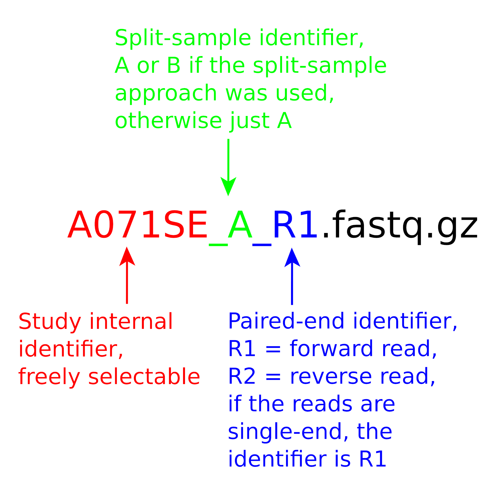

<p align="center">

</p>

---

Natrix is an open-source bioinformatics pipeline for the preprocessing of long and short raw sequencing data. The need for a scalable, reproducible workflow for the processing of environmental amplicon data led to the development of Natrix. It is divided into quality assessment, dereplication, chimera detection, split-sample merging, ASV or OTU generation, and taxonomic assessment. The pipeline is written in [Snakemake](https://snakemake.readthedocs.io) (Köster and Rahmann 2018), a workflow management engine for the development of data analysis workflows. Snakemake ensures the reproducibility of a workflow by automatically deploying dependencies of workflow steps (rules) and scales seamlessly to different computing environments such as servers, computer clusters, or cloud services. While Natrix was only tested with 16S and 18S amplicon data, it should also work for other kinds of sequencing data. The pipeline contains separate rules for each step of the pipeline, and each rule that has additional dependencies has a separate [Conda](https://conda.io/) environment that will be automatically created when starting the pipeline for the first time. The encapsulation of rules and their dependencies allows for hassle-free sharing of rules between workflows.

**To use the latest functions and updates, it is recommended to use the dev-branch of Natrix2**. The dev-branch contains the latest developments and patches that are not yet available in the main-branch. Users who want to stay up to date and experiment with the latest features should use the dev-branch regularly.


**Fig. 1**: DAG of the Natrix2 workflow: Schematic representation of the Natrix2 workflow. The processing of two split samples using AmpliconDuo is depicted. The color scheme represents the main steps, dashed lines outline the OTU variant, and dotted lines outline the ASV variant of the workflow. Stars depict updates to the original Natrix workflow. Details on the ONT part are depicted in Fig. 2.


**Fig. 2**: Schematic diagram of processing nanopore reads with Natrix2 for OTU generation and taxonomic assignment. The color scheme represents the main steps of this variant of the workflow.

---

# Table of contents

1. [Dependencies](#dependencies)
2. [Installation](#installation)
3. [Sequence Count](#sequence-count)
4. [Tutorial](#tutorial)
5. [Cluster execution](#cluster-execution)
6. [Output](#output)
7. [Workflow](#workflow)
8. [Primertable](#primertable-example)
9. [Configuration](#configuration)
10. [References](#references)
11. [Citation](#citation)
12. [Troubleshooting](#troubleshooting)

---

# Dependencies

- [Linux (recommended)](https://ubuntu.com/)  
  The pipeline was developed and tested on the Ubuntu distribution. Linux provides a stable, high-performance environment for running computationally intensive bioinformatics workflows and ensures compatibility with most scientific software.

- [Snakemake](https://snakemake.readthedocs.io/en/stable/)  
  Workflow management system for defining, organizing, and executing reproducible and scalable data analyses. Workflows are described in a readable, Python-based language and executed with automatic handling of dependencies, parallelization, and reproducibility across different computing environments.

- [Conda](https://conda.io/en/latest/index.html)  
  Cross-platform package and environment manager used to install all required software in isolated, reproducible environments. Conda ensures that the correct versions of all dependencies are used and allows easy sharing of the computational environment.

- [GNU screen](https://www.gnu.org/software/screen/)  
  Terminal multiplexer that allows long-running pipeline executions to run in detached
  sessions, preventing termination when the terminal connection is interrupted. GNU
  Screen is available in the repositories of most Linux distributions:

  - Debian/Ubuntu-based systems: `apt-get install screen`
  - RHEL-based systems: `yum install screen`
  - Arch-based systems: `pacman -S screen`

---

# Installation

Conda can be installed via the [Anaconda](https://www.anaconda.com/) or
[Miniconda](https://conda.io/en/latest/miniconda.html) platforms, with
Miniconda3 being recommended for most users; on Linux systems, it can be obtained using:

```shell
wget https://repo.anaconda.com/miniconda/Miniconda3-latest-Linux-x86_64.sh # Download Miniconda installer
```

```shell
bash Miniconda3-latest-Linux-x86_64.sh # Run Miniconda installer
```

Dependencies will be automatically installed using Conda environments and can be
found in the corresponding `environment.yaml` files in the `envs` folder and the
`natrix.yaml` file in the root directory of the pipeline.

**Important:** After setting up your `natrix.yaml` environment, make sure to check the
[Sequence Count](#sequence-count) section before starting the workflow. To install
Natrix, you need the open-source package management system
[Conda](https://conda.io/en/latest/index.html) and, if you want to run Natrix using the
accompanying `pipeline.sh` script, [GNU Screen](https://www.gnu.org/software/screen/).
After cloning this repository to a folder of your choice, it is recommended to create
a general Natrix Conda environment using the provided `natrix.yaml` file; from the
main folder of the cloned repository, run the following command:

```shell
conda env create -f natrix.yaml # Create the Natrix Conda environment
```

Natrix comes with an example [primertable](#example-primertable)
(`example_data.csv`), an example [configfile](#configfile)
(`example_data.yaml`), and an example amplicon dataset located in the
`/example_data` folder. To try out Natrix using the example data
(`Illumina_data` or `Nanopore_data`), run the following command:

```shell
$ ./pipeline.sh # Start Natrix2 pipeline script
Natrix2 Pipeline Script # Output
Enter project name (e.g. illumina_swarm): # Output
$ illumina_swarm # Select illumina_swarm config
```

The pipeline will then start a screen session using the project name (here,
**example_data**) as the session name and begin downloading dependencies for the
workflow rules. To detach from the screen session, press **Ctrl+a, d** (first press
Ctrl+a, then d). To reattach to a running screen session, type:

```shell
screen -r # Reattach to the running screen session
```

When the workflow has finished, press **Ctrl+a, k** (first press Ctrl+a, then k) to
terminate the screen session and stop any remaining processes.

---

# Sequence Count

Before starting the workflow, check the number of sequences in your input files
(`*.fastq`, `*.fastq.gz`), as the workflow may abort if too few sequences are present.
Experience has shown that the workflow fails when the number of sequences is below
150. To avoid this, analyze your data using the `nseqc.py` tool.

**When using the tool, the recommended threshold is `150`.**

The tool compares the specified threshold with the number of sequences in each file.
If a file falls below the threshold, a warning is issued, and the affected files
should be moved out of the input folder to prevent workflow errors.

### Using the nseqc Tool

First, go to your `main directory`. Then, run the following command:

```shell
python3 natrixlib/nseqc.py <folder_path> <threshold> # Check sequence counts in FASTQ files
```

**Once you have checked your data with the tool, you can start the workflow as usual.**

---

# Tutorial

### Prerequisites: dataset, primertable, and configuration file

The FASTQ files need to follow a specific naming convention:

<p align="center">

</p>
<p><b>Fig. 3</b>: Specific naming for the FASTQ files</p>

```shell
samplename_unit_direction.fastq.gz # Samplename = sample ID, unit = A/B, direction = R1 or R2
```

with:
- **samplename**: name of the sample, without special characters.
- **unit**: identifier for
  [split-samples](#ampliconduo--split-sample-approach-illumina--and-nanopore-variant)
  (**A**, **B**). If the split-sample approach is not used, the unit identifier is
  **A**, but it still needs to be specified.
- **direction**: identifier for forward (**R1**) and reverse (**R2**) reads of the
  same sample. For single-end reads, the direction identifier is **R1** and still
  needs to be specified.

A dataset should look like this (two samples, paired-end, no split-sample approach):

```shell
S2016RU_A_R1.fastq.gz # Sample S2016RU, unit A, forward read (R1)
S2016RU_A_R2.fastq.gz # Sample S2016RU, unit A, reverse read (R2)
S2016BY_A_R1.fastq.gz # Sample S2016BY, unit A, forward read (R1)
S2016BY_A_R2.fastq.gz # Sample S2016BY, unit A, reverse read (R2)
```

In addition to the FASTQ files generated during sequencing, Natrix requires a
[primertable](#example-primertable) containing the sample names and, if present, the
length of poly-N tails, primer sequences, and barcodes used for each sample and read
direction. Except for the sample names, all other information may be omitted if the
data has already been preprocessed or does not contain the corresponding
subsequences. Natrix also requires a [configuration](#configfile) file in YAML format
that specifies parameter values for the tools used in the pipeline.

The primertable, configuration file, and the folder containing the FASTQ files must
all be located in the root directory of the pipeline and share the same project name
(with their respective extensions: `project.yaml`, `project.csv`, and the project
folder containing the FASTQ files). The first [configfile](#configfile) entry,
`filename`, must also match the project name.

### Running Natrix2 with `pipeline.sh`

If everything is configured correctly, the pipeline can be started from the terminal
using the `illumina_swarm.yaml` configuration file as an example for running the
workflow with predefined parameters.

```shell
$ ./pipeline.sh # Start Natrix2 pipeline script
Natrix2 Pipeline Script # Output
Enter project name (e.g. illumina_swarm): # Output
$ illumina_swarm # Select illumina_swarm config
```

The pipeline will then start a screen session using the project name as the session
name and begin downloading the required dependencies for the workflow rules. To
detach from the screen session, press `Ctrl+a, d` (first press Ctrl+a, then d). To
reattach to an active screen session, type:

```shell
screen -r # Reattach to the running screen session
```

When the workflow has finished, press `Ctrl+a, d` (first press Ctrl+a, then k) to end
the screen session and terminate any remaining processes.

### Running Natrix with Docker or Docker Compose

A detailed setup guide is available as a PDF in the
[User Guide](documentation/manuals/docker_manual.pdf).

#### Docker Installation and Natrix2 Image

Natrix2 can be executed inside a Docker container. Therefore, Docker must be
installed on your system. If Docker is not yet installed, please refer to the
official [Docker documentation](https://docs.docker.com/engine/install/) for
installation instructions and initial setup.

To verify that Docker is installed correctly, run:

```bash
docker --version # Check Docker installation
```

To run the Docker container, download the pre-built image from
[Docker Hub](https://hub.docker.com/r/dbeisser/natrix2).

```bash
docker pull dbeisser/natrix2:latest # Download Natrix2 image
```

#### Environment Setup

**Step 1:**  
Before using Docker, create the following directories on your system: `input`,
`output`, and `database`. You may also review the example folder structure below.

**Step 2:**  
Copy the configuration file (**config.yaml**) and the primer table (**primer.csv**)
used for your analysis into the `input` directory. You may create a subdirectory for
your sample files; however, the configuration file and primer table must be located
directly in the `input` directory. Ensure that all paths are specified correctly in
the configuration file.

**Step 3:**  
Open the configuration file (**config.yaml**) with a text editor and adjust the
parameters for your samples. Before starting the analysis, make sure to set the
number of CPU cores and the available working memory (RAM).

**Step 4:**   
Define the path to your input data in the configuration file so the
pipeline can locate it correctly (e.g. `filename: input`); if your data is stored
in a subdirectory, adjust the path accordingly (e.g. `filename: input/samples`).
The same rule applies to the primer table path.

**Example folder structure**

```bash
# Folder structure for the Docker container (to be created locally)

./natrix2/ # Main project directory
    input/ # Files required for analysis
        samples/ # Input FASTQ files
        config.yaml # Configuration file
        primer.csv # Primer table
    output/ # Analysis output
        results/ # Result files
    database/ # Reference database
```

#### Example config.yaml

```yaml
# Example configuration file

general:
    filename: input/samples # Samples directory
    output_dir: output/results # Results directory
    primertable: input/primer.csv # Primer table path
    cores: 20 # Number of CPU cores
    memory: 10000 # RAM in megabytes
    ...
```

#### Create Docker Container

The Docker container includes all environments pre-installed, so the workflow does
not need to download them during the first initialization. To open a shell inside
the container, run:

```bash
# Replace </your/local/> with your local paths to the natrix2 directories
# Example: /your/local/natrix2/input => /path/to/natrix2/input

docker run -it --label natrix2_container \
  -v /your/local/natrix2/input:/app/input \
  -v /your/local/natrix2/output:/app/output \
  -v /your/local/database:/app/database \
  dbeisser/natrix2:latest bash
```

Functions of the respective folders:

- `/host/input` is the full path to a local directory containing your samples,
  configuration file (**config.yaml**), and primer table (**primer.csv**). Use the
  same project name for the configuration file and primer table.

- `/host/output` is the full path to a local directory where the workflow output will
  be written so it is accessible outside the container.

- `/host/database` is the full path to a local directory where the database
  (**SILVA** or **NCBI**) can be installed. This is optional and only required if
  BLAST is used for taxonomic assignment.

---

#### Run Natrix2 in a Configured Docker Container

After connecting to the container shell, you can follow the instructions in
[running Natrix manually](#running-natrix-manually).

Alternatively, you can use the `docker_pipeline.sh` script. Once the container is
running and the environment is configured, start the analysis by specifying the
name of your configuration file (located in the `input` directory).

```bash
# Replace <config> with the name of your configuration file
./docker_pipeline.sh config
```

To test the Docker container before running your own data, you can use the provided
test dataset containing Nanopore data. Start a test run using the
`test_docker.yaml` configuration file:

```bash
# Start a test run using the provided sample data
./docker_pipeline.sh test_docker
```

---

#### Use Docker Compose

Alternatively, the workflow can be started using Docker Compose from the root
directory of the pipeline. Make sure that Docker Compose is installed on your
system before proceeding. You can verify the installation with:

```shell
docker-compose --version # Check Docker Compose installation
```

All container-related directories will be located under `/srv/docker/`.

**Step 1:**  
Copy your `samples/` directory, `config.yaml`, and `primer.csv` files to
`/srv/docker/natrix2_cont_1/input/`. If the `natrix2_cont_1/` directory does not yet
exist, create the required container folder structure first (see the recommended
[Docker Compose folder structure](#example-folder-structure-for-docker-compose)
below). By default, the container will wait until the input files are available.

#### Example: Folder structure for Docker Compose

```bash
# Check the docker-compose.yaml file for additional configuration details.

# natrix2_cont_1 (container 1)
./srv/docker/natrix2_cont_1/
    input/
        samples/ # Samples to be analyzed
        config.yaml # Configuration file
        primer.csv # Primer table
    output/            
        results/ # Analysis results
    database/ # Reference database

# Additional containers can be added if required
# e.g. natrix2_cont_2, natrix2_cont_3, ...
```

**Step 2:**   
Open your configuration file in a text editor and define all required
directories and file paths. Then configure the parameters for your samples. Refer
to the [example configuration](#example-configyaml) for guidance.

**Step 3:**   
Assign a project name to your configuration file, which will be used at
startup. To run multiple containers, specify a unique project name for each
container in the `docker-compose.yaml` file.

**Example:** rename `config.yaml` to `project_name.yaml`.

**Step 4:**   
Once everything is configured correctly, start the container using the
commands listed below. During the first launch, required databases will be
downloaded to `natrix2_cont_1/databases/`, which may take some time.

**If multiple containers are required, set up all corresponding container
directories in advance as defined in `docker-compose.yaml`.**

```shell
# Optional: the '-d' parameter starts the container in detached mode
sudo PROJECT_NAME="project_name" docker compose up -d
```

If multiple containers are defined in the docker-compose.yaml file, all containers
can be started at once using the following command. Make sure that all paths and
project names are specified correctly to ensure a successful analysis.

```shell
sudo docker compose up # Start all defined containers
```

#### Building the Container Manually

If you prefer to build the Docker container yourself from the repository (for
example, after modifying the Natrix source code), you can build the container using
the following command:

```bash
docker build -t natrix2 . # Build the Natrix2 Docker image locally
```

---

### Running Natrix2 Manually

If you prefer to run the preparation script and Snakemake manually, start by
activating the Natrix Conda environment:

```shell
conda activate natrix # Activate the Snakemake ENV
```

Next, run the preparation script, where project refers to the name of your
project:

```shell
python3 create_dataframe.py <project>.yaml # Create units.tsv file
```

This command generates the `units.tsv` file, which contains the sample information
in a format required by Natrix.

To start the main pipeline, run:

```shell
snakemake --use-conda --configfile <project>.yaml --cores <cores> # Start pipeline
```

Here, project refers to the project name and cores specifies the number of
CPU cores allocated to Natrix. If the pipeline terminates prematurely (e.g. due to an error or manual
interruption), rerunning the same command will resume execution from the point at
which it stopped.

---

# Cluster Execution

Natrix can be run on cluster systems using either Conda or the Docker container.
For most cluster environments, it is sufficient to add the `--cluster` option to
the Snakemake command together with a job submission command (e.g. `qsub`).

An example command is shown below:

```shell
snakemake -s <path/to/Snakefile> --use-conda \
  --configfile <path/to/configfile.yaml> \
  --cluster "qsub -N <project_name> -S /bin/bash/" \
  --jobs 100
```

Additional qsub arguments with brief explanations can be found in the
[qsub documentation](http://bioinformatics.mdc-berlin.de/intro2UnixandSGE/sun_grid_engine_for_beginners/how_to_submit_a_job_using_qsub.html).
To run additional commands for each job, the `--jobscript path/to/jobscript.sh`
option can be used. An example job script that sources `.bashrc` and activates the
Snakemake environment before execution is shown below:

```shell
#!/usr/bin/env bash
source ~/.bashrc # Load user environment
conda activate natrix # Activate Natrix2 Conda environment
{exec_job} # Execute Snakemake job command
```

Instead of passing cluster submission arguments directly to the Snakemake command,
it is also possible to use a Snakemake profile that defines cluster commands and
resource settings. Profiles allow the specification of rule-specific hardware
requirements. For example, rules such as BLAST benefit from a high number of CPU
cores, while other rules (e.g. AmpliconDuo) require fewer resources. By assigning
appropriate resources per rule, profiles enable more efficient use of cluster
resources and can reduce queue waiting times. Profile creation depends on the
available cluster software and hardware. Once a profile is configured, Natrix can
be executed with:

```shell
snakemake -s <path/to/Snakefile> --profile myprofile # Run Natrix2 using a Snakemake profile
```

The Snakemake documentation provides a tutorial on
[profile creation](https://snakemake.readthedocs.io/en/stable/executing/cli.html#profiles),
and example profiles for different cluster systems are available on the
[Snakemake profiles GitHub page](https://github.com/snakemake-profiles/doc).

---

# Output

After the workflow has finished, all results can be found in the output directory.

<p align="center">

</p>

**Fig. 4**: The output file hierarchy: Blue nodes represent folders, orange nodes represent files that are created in both variants of the workflow, green nodes represent files exclusive to the OTU variant, and purple nodes represent files exclusive to the ASV variant of the workflow.

| Folder                                | File(s)                    | Description                                                                                                              |
|---------------------------------------|----------------------------|--------------------------------------------------------------------------------------------------------------------------|
| qc                                    | FastQC reports             | Quality reports generated by the FastQC application.                                                                               |
|                                       | MultiQC report             | Aggregated FastQC reports in a single file.                                                                              |
| logs                                  | Logfiles                   | Logfiles of the different rules.                                                                                         |
| assembly (one folder for each sample) | sample_low_qual.fastq      | Sequences from the sample that did not pass the PRINSEQ quality filtering.                                                     |
|                                       | sample_assembled.fastq     | Sequences assembled with PANDAseq.                                                                                       |
|                                       | sample_singletons.fastq    | Sequences that could not be assembled.                                                                                   |
|                                       | sample.fasta               | FASTA file of the assembled sequences.                                                                                   |
|                                       | sample.dereplicated.fasta  | Dereplicated sequences from the sample.                                                                                        |
|                                       | sample_chimera.fasta       | Sequences from the sample that are thought to be of chimeric origin.                                                           |
| finalData                             | sample.nonchimera.fasta    | Sequences from the sample that passed the chimera detection rule.                                                              |
|                                       | full_table.csv             | Table containing the sequences of all samples and their abundances per sample.                                          |
|                                       | full_table_mumu.csv        | Table containing the sequences of all samples, their abundances per sample, and the taxonomy after post-clustering with mumu. |
|                                       | filtered_out_table.csv     | Table containing the sequences that did not pass the filtering rule.                                                     |
|                                       | filtered.fasta             | The sequences from the filtered_table.csv file in FASTA format.                                                                 |
|                                       | filtered_blast_table.csv   | Table containing the sequences from filtered_table.csv and the taxonomic information assigned to each.                 |
| figures                               | ampliconduo_unfiltered.png | Discordance graph before filtering.                                                                                  |
|                                       | ampliconduo_filtered.png   | Discordance graph after filtering.                                                                                       |
|                                       | AmpliconDuo.Rdata          | RData file containing the results of the AmpliconDuo statistical analysis.                                               |
| clustering                            | VSEARCH clustering files   | OTU clustered files with VSEARCH.                                                                                        |
| filtering                             | unfiltered_table.csv       | Table containing representative sequences assembled with cd-hit.                                                              || filtering                             |                            |                                                                                                                          |
|                                       | filtered_table.csv         | Table containing sequences passing the cutoff value.                                                                     || filtering                             |                            |                                                                                                                          |
|                                       | filtered_out_table.csv     | Table containing sequences not passing the cutoff value.                                                                 || filtering                             |                            |                                                                                                                          |
| mothur                                | Database assigned taxonomy | Taxonomy, FASTA, and CSV files with taxonomy assigned to the chosen database.                                                 |
| quality_filtering                     | Filtered files             | Nanopore FASTQ files filtered by quality and length.                                                                        |
| pychopper                             | output                     | Reoriented and primer-trimmed output of the first round of Pychopper.                                                      |
|                                       | pychopper_unclass          | Reoriented and primer-trimmed output of the rescue-specific round of Pychopper.                                            |
|                                       | reports                    | Reorientation and trimming reports for each file.                                                                        |
|                                       | rescued                    | Sequences that were not able to orient and trim but could be rescued.                                               |
|                                       | unclassified               | Sequences that were not able to orient and trim during the first round of Pychopper.                                 |
|                                       | pychopper_merged           | Reoriented and primer-trimmed merged output of the first round and the rescue-specific round of Pychopper.                     |
| read_correction                       | cd_hit                     | Representative sequences from assembled Nanopore sequences.                                                                |
|                                       | counts_mapping             | Medaka alignment with raw reads for the quantification of Medaka representative sequences.                                   |
|                                       | medaka                     | Medaka error-corrected sequences.                                                                                        |
|                                       | minimap                    | FASTA files aligned to cd_hit representative sequences.                                                                 |
|                                       | racon                      | Racon polished sequences for error correction.                                                                           |

<p><b>Table 1</b>: Output files from Natrix2</p>

---

# Workflow

## Initial Demultiplexing (Illumina Variant)

Demultiplexing refers to the sorting of sequencing reads according to their  
associated barcode sequences.

## Quality Control (Illumina Variant)

For quality control, the pipeline uses the tools FastQC (Andrews 2010),  
MultiQC (Ewels et al. 2016), and PRINSEQ (Schmieder and Edwards 2011).

### FastQC

FastQC generates a quality report for each FASTQ file, providing information on  
per-base and average sequence quality (based on Phred scores), GC content,  
overrepresented sequences, adapter contamination, and k-mer composition.

### MultiQC

MultiQC aggregates individual FastQC reports into a single summary report,  
allowing the quality assessment of all FASTQ files at once.

### PRINSEQ

PRINSEQ is used to filter sequences with an average quality score below the  
threshold specified in the pipeline configuration file.

## Read Assembly (Illumina Variant)

### Primer Definition

The `define_primer` rule specifies the subsequences that are removed during the
assembly step. These subsequences are defined by entries in the configuration file
and a primer table containing information on primer sequences, barcode sequences,
and the length of poly-N regions. In addition to removing subsequences based on
their nucleotide sequence, removal can also be performed solely based on their
length using an offset. This offset-based approach is useful when primer regions
contain many uncalled bases, which may otherwise prevent proper matching between
the primer table entries and the sequencing reads.

### Assembly and Removal of Undesired Subsequences (OTU Variant)

For paired-end read assembly and removal of undesired subsequences, PANDAseq
(Masella et al. 2012) is used. PANDAseq applies probabilistic error correction to
assemble overlapping forward and reverse reads. After assembly and trimming,
sequences are removed if they fall outside defined minimum or maximum length
thresholds, have an assembly quality score below the threshold specified in the
configuration file, or if the overlap between forward and reverse reads is
insufficient. All thresholds can be adjusted in the configuration file.

For single-end reads, the undesired subsequences (poly-N regions, barcodes, and
primers) defined in the `define_primer` rule are removed first, followed by the
filtering of sequences based on the configured length thresholds.

### Removal of Undesired Subsequences (ASV Variant)

In the ASV variant of the workflow, Cutadapt (Martin 2011) is used to remove the  
undesired subsequences defined in the primer table.

### ASV Denoising (ASV Variant)

After subsequence removal, amplicon sequence variants (ASVs) are generated using
the DADA2 algorithm (Callahan et al. 2016). DADA2 dereplicates the dataset and applies
a denoising algorithm that infers true biological sequences based on sequence
composition, quality scores, abundance, and an Illumina error model. Following ASV
inference, exactly overlapping forward and reverse reads are assembled. The final
ASVs are stored as FASTA files for downstream analyses.

## Quality Filtering (Nanopore Variant)

For quality control and filtering of Nanopore reads, the pipeline uses Chopper  
(De Coster and Rademakers 2023).

### Pychopper (Nanopore Variant)

Pychopper reorients Oxford Nanopore reverse reads into forward reads based on a
minimum mean base quality and removes sequencing adapters, barcodes, and primer
sequences from the reads.

### Read Correction (Nanopore Variant)

### CD-HIT Clustering

The CD-HIT-EST algorithm (Fu et al. 2012) clusters sequences that are either identical
or where one sequence is a subsequence of another, a process known as
dereplication. The algorithm starts with the longest sequence in the dataset as the
initial representative sequence and iterates through the remaining sequences in
descending order of length. Each query sequence is compared against all current
representative sequences. If the sequence identity threshold specified in the
configuration file is met for a representative sequence, its count is incremented.
If no representative meets the threshold, the query sequence is added as a new
representative.

The resulting clusters are then mapped against the previously generated FASTA files
using Minimap (Li 2018).

### Racon

Error-corrected consensus sequences are generated by aligning quality-filtered reads
to the clustered sequences using Racon, which performs distance-based consensus
polishing.

### Medaka

Medaka maps FASTA sequences against the Racon-polished consensus sequences using a
neural network–based polishing approach to further improve sequence accuracy.

## Similarity Clustering (Illumina and Nanopore Variant)

### Conversion of FASTQ to FASTA (OTU Variant)

In the OTU variant of the workflow, the `copy_to_fasta` rule converts FASTQ files to
FASTA format. This reduces disk usage and enables the use of CD-HIT, which requires
FASTA-formatted input files.

### CD-HIT Clustering

The CD-HIT-EST algorithm (Fu et al. 2012) is used to cluster sequences based on
sequence identity or subsequence relationships. As in the Nanopore workflow, the
longest sequence is selected as the initial representative, and remaining sequences
are processed in descending order of length. Sequences that meet the identity
threshold defined in the configuration file are assigned to existing clusters,
while others form new representative clusters.

### Cluster Sorting

The `cluster_sorting` rule uses the output of the `cdhit` rule to determine the
number of sequences represented by each cluster. Representative sequences are then
sorted in descending order based on cluster size. In addition, a specific header is
added to each sequence, as required by the UCHIME chimera detection algorithm.

## Chimera Detection (Illumina and Nanopore Variant)

### VSEARCH

VSEARCH is an open-source alternative to the USEARCH toolkit that aims to replicate
the functionality of USEARCH algorithms, whose source code is not publicly available
and is often only briefly described (Rognes et al. 2016). In Natrix, the VSEARCH
`uchime3_denovo` algorithm (hereafter referred to as VSEARCH3) is used as an
alternative to UCHIME for the detection of chimeric sequences. VSEARCH3 is an
implementation of the UCHIME2 algorithm with optimized default parameters.

The UCHIME2 algorithm is described by Edgar (2016) as follows:

> "Given a query sequence *Q*, UCHIME2 uses the UCHIME algorithm to construct a model
> (*M*), then makes a multiple alignment of *Q* with the model and top hit (*T*, the
> most similar reference sequence). The following metrics are calculated from the
> alignment: number of differences d<sub>QT</sub> between Q and T and d<sub>QM</sub>
> between *Q* and *M*, the alignment score (*H*) using eq. 2 in R. C. Edgar et al.
> 2011. The fractional divergence with respect to the top hit is calculated as
> div<sub>T</sub> = (d<sub>QT</sub> − d<sub>QM</sub>)/|Q|. If divT is large, the model
> is a much better match than the top hit and the query is more likely to be
> chimeric, and conversely if div<sub>T</sub> is small, the model is more likely to
> be a fake."

The main difference between the UCHIME2 and UCHIME3 algorithms lies in the abundance
criteria used to select potential parent sequences. In UCHIME3, a potential parent
must have at least sixteen times the abundance of the query sequence, whereas in
UCHIME2, only a twofold abundance is required.

## Table Creation and Filtering (Illumina and Nanopore Variant)

### Merging FASTA Files into a Single Table

For downstream processing, the `unfiltered_table` rule merges all FASTA files into a
single nested dictionary. In this structure, each sequence serves as a key, and the
corresponding value is another dictionary containing all (split-) samples in which
the sequence occurs, along with the respective sequence abundances. For intermediate
pipeline processing, this data structure is temporarily stored in JSON format. To
enable statistical analyses, the same information is additionally exported as a
comma-separated table.

#### Filtering

In the filtering rule of the pipeline, all sequences that do not occur in both
split-samples of at least one sample are removed. For single-sample data, the
filtering rule applies an abundance cutoff value, which can be specified in the
configuration file, to remove all sequences with abundances less than or equal to
the defined threshold. Both the retained sequences and the filtered-out sequences
are subsequently exported as comma-separated tables.

### Conversion of Tables to FASTA Files

Since the `swarm` rule requires FASTA-formatted input, the table resulting from the
filtering step is converted into a FASTA file using the `write_fasta` rule.

## AmpliconDuo / Split-Sample Approach (Illumina and Nanopore Variant)

The pipeline supports both single-sample and split-sample FASTQ amplicon data. The
split-sample protocol (Lange et al. 2015) aims to reduce the number of sequences
originating from PCR or sequencing errors without relying on stringent abundance
cutoffs, which may remove rare but biologically relevant sequences. In this
approach, extracted DNA from a single sample is divided into two split-samples,
which are then independently amplified and sequenced. Sequences that do not occur
in both split-samples are considered erroneous and are filtered out. This method is
based on the assumption that sequences generated by PCR or sequencing errors are
unlikely to occur independently in both samples. A schematic overview of the
split-sample approach is shown below.

<p align="center">

</p>

**Fig. 5:** Schematic representation of the split-sample approach. Extracted DNA from
a single environmental sample is split and separately amplified and sequenced. The
filtering rule compares the resulting read sets between the two split-samples and
filters out all sequences that do not occur in both. Image adapted from Lange et al.
(2015).

The initial proposal for the split-sample approach by Dr. Lange was accompanied by the release of the R package [AmpliconDuo](https://cran.r-project.org/web/packages/AmpliconDuo/index.html) for the statistical analysis of amplicon data produced by the aforementioned split-sample approach. It uses Fisher's exact test to detect significantly deviating read numbers between two experimental branches, A and B, from the sample S. To measure the discordance between two branches of a sample, the read-weighted discordance ∆<sup>r</sup><sub>Sθ</sub>, which is weighted by the average read number of sequence i in both branches, and the unweighted discordance ∆<sup>u</sup><sub>Sθ</sub> for each sequence i are calculated. If ∆<sup>u</sup><sub>Sθ</sub> = 0, each branch of sample S contains the same set of sequences, while if ∆<sup>r</sup><sub>Sθ</sub> = 0, the read numbers for each sequence in sample S are within the error margin set by the chosen false discovery rate. The results of the discordance calculations are then plotted for visualization purposes and written to an R data file to allow the filtering of significantly deviating sequences.

## OTU Generation (Illumina and Nanopore Variant)

### SWARM Clustering

OTUs are generated using the Swarm clustering algorithm (Mahé et al. 2015) in the
corresponding pipeline rule. Swarm clusters sequences into OTUs using an iterative
approach with a local clustering threshold. Initially, a pool of amplicons is
created from the input file and an empty OTU is initialized. The first amplicon is
removed from the pool and selected as the OTU seed. All remaining amplicons that
differ from this seed by no more than a user-defined threshold (default: one
nucleotide difference) are removed from the pool and added to the OTU as subseeds.

In subsequent iterations, all amplicons whose nucleotide difference to any of the
existing subseeds does not exceed the threshold are added to the OTU. This iterative
process continues until no further amplicons can be recruited, at which point the
OTU is closed and a new OTU is initialized. This strategy avoids two major sources
of variability associated with greedy clustering approaches: dependency on the
input order, where the first sequence becomes the OTU centroid, and the use of a
global similarity threshold that recruits all sequences within a fixed distance to
the centroid.

Instead, Swarm produces a star-shaped minimum spanning tree, typically centered on
a highly abundant amplicon, independent of the initial seed selection. The sequence
located at the center of each OTU tree is used as the representative sequence for
subsequent analysis steps, as illustrated in Figure 6.

<p align="center">

</p>

**Fig. 6:** Schematic representation of the greedy clustering approach and the
iterative Swarm approach. The greedy approach (a), which uses a global clustering
threshold *t* and input order–dependent centroid selection, can result in closely
related amplicons being assigned to different OTUs. In contrast, the iterative
Swarm approach (b), which applies a local threshold *d*, forms OTUs containing only
closely related amplicons with a centroid that emerges naturally during the
iterative clustering process. Image from Mahé et al. (2015).

### VSEARCH Clustering

OTUs can alternatively be generated using the de novo clustering algorithm provided
by the VSEARCH toolkit (Rognes et al. 2016). This algorithm follows a greedy,
centroid-based approach with a configurable sequence similarity threshold defined
in the pipeline configuration file. Input sequences are processed sequentially and
compared against an initially empty database of centroid sequences. Each query
sequence is assigned to the first centroid that meets or exceeds the similarity
threshold; if no such centroid exists, the sequence is designated as a new
centroid.

## Sequence Comparison (Illumina and Nanopore Variant)

Assigning taxonomic information to OTUs or ASVs is a key step in the analysis of
environmental amplicon data, as taxonomic identities can be used to infer ecological
characteristics of the sampled environment. To identify sequences similar to each
OTU or ASV representative, the BLAST (Basic Local Alignment Search Tool) algorithm
(Altschul et al. 1990) is used to search against the SILVA database (Pruesse et al.
2007).

The SILVA database contains curated and aligned rRNA sequence data generated through
a multi-step curation process. While it provides extensive coverage of prokaryotic
rRNA sequences, its representation of microbial eukaryotes is more limited. If the
database is not available locally, the required files are automatically downloaded
and the database is built using the `make_silva_db` rule. The BLAST search itself is
performed in the `blast` rule using the nucleotide–nucleotide BLAST variant
(BLASTn).

The tab-separated output of the BLAST rule contains the following information for
each representative sequence, provided that the BLASTn results meet the criteria
specified in the [configuration](#configuration) file:

| Column Nr. | Column Name | Description                                   |
|------------|-------------|-----------------------------------------------|
| 1.         | qseqid      | Query sequence identification                 |
| 2.         | qlen        | Length of the query sequence                  |
| 3.         | length      | Length of the alignment                       |
| 4.         | pident      | Percentage of identical matches               |
| 5.         | mismatch    | Number of mismatches                          |
| 6.         | qstart      | Start of the alignment in the query sequence  |
| 7.         | qend        | End of the alignment in the query sequence    |
| 8.         | sstart      | Start of the alignment in the target sequence |
| 9.         | send        | End of the alignment in the target sequence   |
| 10.        | gaps        | Number of gaps                                |
| 11.        | evalue      | E-value                                       |
| 12.        | stitle      | Title (taxonomy) of the target sequence       |

<p><b>Table 2:</b> BLAST output column descriptions</p>

## Merging of Results (Illumina and Nanopore Variant)

The outputs generated by the `write_fasta`, `swarm`, and `blast` rules are merged
into a single comma-separated table using the `merge_results` rule. For each
representative sequence, this table contains the sequence identifier, the nucleotide
sequence, the abundance of the sequence in each sample, the total abundance across
all samples, and—if a BLAST hit is available—all annotation fields listed in
Table 2.

---

# Primertable Example

The primertable should be a CSV file `project.csv` in the following format:

| Probe     | poly_N | Barcode_forward | specific_forward_primer | poly_N_rev | Barcode_reverse | specific_reverse_primer |
|-----------|--------|-----------------|-------------------------|------------|-----------------|-------------------------|
| S2016BY_A | NNNNN  |                 | GTACACACCGCCCGTC        | N          |                 | GCTGCGYYCTTCATCGDTR     |
| S2016RU_A | NNNN   |                 | GTACACACCGCCCGTC        | NN         |                 | GCTGCGYYCTTCATCGDTR     |

<p><b>Table 3</b>: Example Primertable</p>

---

# Configuration

Below are the explanations for the configfile `project.yaml` entries:

| Option            | Default                                                   | Description                                                                                                                                                                                                                                   |
|-------------------|-----------------------------------------------------------|-----------------------------------------------------------------------------------------------------------------------------------------------------------------------------------------------------------------------------------------------|
| filename          | project                                                   | The path / filename of the project folder, primertable (.csv), and configfile (.yaml). If the raw data folder is not in the root directory of Natrix, please add the path relative to the root directory (e.g., input/example_data).             |
| output_dir        | output                                                    | Path to custom output directory / relative to the root directory of Natrix (DO NOT change this value if you are using Docker! Leave it as output).                                                                                           |
| primertable       | project.csv                                               | Path to the primertable. If the primertable is not in the root directory of Natrix, please add the path relative to the root directory (e.g., input/example_data.yaml).                                                                         |
| units             | units.tsv                                                 | Path to the sequencing unit sheet.                                                                                                                                                                                                            |
| cores             | 4                                                         | Amount of cores available for the workflow.                                                                                                                                                                                                   |
| memory            | 1000                                                      | Available RAM in Mb.                                                                                                                                                                                                                          |
| multiqc           | False                                                     | Initial quality check (fastqc & multiqc), currently only works for not yet assembled reads.                                                                                                                                                   |
| demultiplexing    | False                                                     | Demultiplexing for reads that were not demultiplexed by the sequencing company (slow).                                                                                                                                                        |
| read_sorting      | False                                                     | Read sorting for paired-end reads that were not sorted by the sequencing company (slow).                                                                                                                                                      |
| already_assembled | False                                                     | Skipping of the quality control and read assembly steps for data that is already assembled.                                                                                                                                                   |
| seq_rep           | OTU                                                       | How the sequences should be represented, possible values are: "ASV", amplicon sequence variants, created with DADA2, or "OTU", operational taxonomic units, created with SWARM or VSEARCH.                                                     |
| nanopore          | FALSE                                                     | Boolean for the use of long sequences, e.g., Nanopore (TRUE), or short sequences, e.g., Illumina (FALSE).                                                                                                                                        |
| quality_filt      | 15                                                        | Minimum Phred quality score.                                                                                                                                                                                                                  |
| min_length        | 1000                                                      | Minimum length of reads.                                                                                                                                                                                                                      |
| max_length        | 4500                                                      | Maximum length of reads.                                                                                                                                                                                                                      |
| head_trim         | 0                                                         | Trim N nucleotides from the start of reads.                                                                                                                                                                                                   |
| tail_trim         | 0                                                         | Trim N nucleotides from the end of reads.                                                                                                                                                                                                     |
| pychopper         | TRUE                                                      | Boolean that indicates if pychopper should be used for reorientation, trimming, and quality check of reads, if not done before.                                                                                                                |
| pychopqual        | 7                                                         | Minimum mean Q-score base quality for pychopper (default 7).                                                                                                                                                                                  |
| threshold         | 0.9                                                       | PANDAseq score threshold a sequence must meet to be kept in the output.                                                                                                                                                                       |
| minoverlap        | 15                                                        | Sets the minimum overlap between forward and reverse reads.                                                                                                                                                                                   |
| minqual           | 1                                                         | Minimal quality score for bases in an assembled read to be accepted by PANDAseq.                                                                                                                                                              |
| minlen            | 100                                                       | The minimal length of a sequence after primer removal to be accepted by PANDAseq.                                                                                                                                                             |
| maxlen            | 600                                                       | The maximal length of a sequence after primer removal to be accepted by PANDAseq.                                                                                                                                                             |
| primer_offset     | False                                                     | Using PANDAseq to remove primer sequences by length offset instead of sequence identity.                                                                                                                                                      |
| mq                | 25                                                        | Minimum quality sequence check (prinseq), filtering of sequences according to the PHRED quality score before the assembly.                                                                                                                    |
| barcode_removed   | True                                                      | Boolean that indicates if the sequence is free of barcodes.                                                                                                                                                                                   |
| all_primer        | True                                                      | Boolean that indicates if the sequence is free of any kind of additional subsequences (primer, barcodes, etc.).                                                                                                                                |
| clustering        | 1.0                                                       | Percent identity for CD-HIT (dereplication) (1 = 100%), if CD-HIT is solely to be used for dereplication (recommended), keep the default value.                                                                                                 |
| length_overlap    | 0.0                                                       | Length difference cutoff, default 0.0. If set to 0.9, the shorter sequences need to be at least 90% length of the representative of the cluster.                                                                                               |
| representative    | longest                                                   | Which sequence to use as a representative sequence per CD-HIT cluster. longest = the longest sequence of the corresponding cluster, most_common = the most common sequence of the corresponding cluster.                                       |
| beta              | 8.0                                                       | Weight of a "no" vote for the VSEARCH chimera detection algorithm.                                                                                                                                                                            |
| pseudo_count      | 1.2                                                       | Pseudo-count prior on number of “no” votes.                                                                                                                                                                                                 |
| abskew            | 16                                                        | Minimum abundance skew, defined by (min(abund.(parent1), abund.(parent2))) / abund.(child).                                                                                                                                                    |
| filter_method     | not_split                                                 | If the split sample approach was used (split_sample) or not (not_split). (Not recommended for Nanopore data, use "cutoff" instead.)                                                                                                           |
| ampliconduo       | FALSE                                                     | Boolean, whether AmpliconDuo should be used for statistical analysis of the data.                                                                                                                                                             |
| cutoff            | 3                                                         | An additional abundance filter if the split sample approach was not used.                                                                                                                                                                     |
| ampli_corr        | fdr                                                       | Specifies the correction method for Fisher's exact test.                                                                                                                                                                                      |
| save_format       | png                                                       | File format for the frequency-frequency plot.                                                                                                                                                                                                 |
| plot_AmpDuo       | True                                                      | If the frequency-frequency plot should be saved.                                                                                                                                                                                              |
| paired_End        | True                                                      | The format of the sequencing data, TRUE if the reads are in paired-end format.                                                                                                                                                                |
| name_ext          | R1                                                        | The identifier for the forward read (for the reverse read the 1 is switched with 2, if the data is in paired-end format), has to be included at the end of the file name, before the file format identifier (including for single end files). |
| clustering        | vsearch                                                   | Allows you to specify OTU clustering method to use. Your options are: swarm and vsearch. Nanopore only supports vsearch option.                                                                                                               |
| vsearch_id        | 0.98                                                      | Percent identity for vsearch OTU clustering (1 = 100%).                                                                                                                                                                                      |
| mumu              | TRUE                                                      | Boolean for the use of MUMU, only for OTU clustering.                                                                                                                                                                                         |
| mothur            | TRUE                                                      | Boolean for the use of mothur.                                                                                                                                                                                                                |
| search            | kmer                                                      | Allows you to specify the method to find most similar template. Your options are: suffix, kmer, blast, align, and distance. The default is kmer.                                                                                               |
| method            | wang                                                      | Allows you to specify classification method to use. Your options are: wang, knn and zap. The default is wang.                                                                                                                                 |
| database          | pr2                                                       | Database against which mothur should be carried out, at the moment "pr2", "unite", and "silva" are supported.                                                                                                                                 |
| pr2               | 4.14.0                                                    |                                                                                                                                                                                                                                               |
| silva             | 138.1                                                     |                                                                                                                                                                                                                                               |
| silva_tax         | database/silva_db.138.1.tax                               | Path for Silva taxonomy database.                                                                                                                                                                                                             |
| silva_ref         | database/silva_db.138.1.fasta                             | Path for Silva reference database.                                                                                                                                                                                                            |
| pr2_ref           | database/pr2db.4.14.0.fasta                               | Path for PR2 reference database.                                                                                                                                                                                                              |
| pr2_tax           | database/pr2db.4.14.0.tax                                 | Path for PR2 taxonomy database.                                                                                                                                                                                                               |
| unite_ref         | database/unite_v10.fasta                                 | Path for UNITE reference database.                                                                                                                                                                                                            |
| unite_tax         | database/unite_v10.tax                                   | Path for UNITE taxonomy database.                                                                                                                                                                                                             |
| blast             | False                                                     | Boolean to indicate the use of the BLAST clustering algorithm to assign taxonomic information to the OTUs.                                                                                                                                    |
| database          | SILVA                                                     | Database against which the BLAST should be carried out, at the moment "NCBI" and "SILVA" are supported.                                                                                                                                       |
| drop_tax_classes  | '.\*unclassified Bacteria.\*,.\*uncultured.\*bacterium.*' | Given a comma-separated list, drops undesired classes either by id, by name, or using regex.                                                                                                                                                   |
| db_path           | database/silva/silva.db                                   | Path to the database file against which the BLAST should be carried out, at the moment only the SILVA and NCBI databases will be automatically downloaded, other databases have to be downloaded and configured manually.                   |
| max_target_seqs   | 1                                                         | Number of blast hits that are saved per sequence / OTU.                                                                                                                                                                                       |
| ident             | 90.0                                                      | Minimal identity overlap between target and query sequence.                                                                                                                                                                                   |
| evalue            | 1e-51                                                     | Highest accepted evalue.                                                                                                                                                                                                                      |

<p><b>Table 4:</b> Configuration options</p>

---

# References

- Köster, Johannes & Rahmann, Sven (2018). “Snakemake—a scalable bioinformatics workflow engine”. *Bioinformatics*, 34(20), pp. 3600–3602. https://doi.org/10.1093/bioinformatics/bty350
- Ewels, P. et al. (2016). “MultiQC: Summarizes analysis results for multiple tools and samples in a single report”. *Bioinformatics*, 32(19), pp. 3047–3048. https://doi.org/10.1093/bioinformatics/btw354
- Anaconda, Inc. (2012). *Conda: Package, dependency and environment management for any language.* https://docs.conda.io
- Van Rossum, G., & Drake, F. L. (2009). *Python 3 Reference Manual.* CreateSpace, Scotts Valley, CA. https://www.python.org
- R Core Team. (2023). *R: A Language and Environment for Statistical Computing.* R Foundation for Statistical Computing, Vienna, Austria. https://www.R-project.org
- Andrews, S. (2010). *FastQC: A quality control tool for high throughput sequence data.* https://www.bioinformatics.babraham.ac.uk/projects/fastqc/
- Martin, M. (2011). “Cutadapt removes adapter sequences from high-throughput sequencing reads”. *EMBnet.journal*, 17(1), p. 10. https://doi.org/10.14806/ej.17.1.200
- Schmieder, Robert & Edwards, Robert A. (2011). “Quality control and preprocessing of metagenomic datasets”. *Bioinformatics*, 27(6), pp. 863–864. https://doi.org/10.1093/bioinformatics/btr026
- Masella, Andre P. et al. (2012). “PANDAseq: paired-end assembler for Illumina sequences”. *BMC Bioinformatics*, 13(1), p. 31. https://doi.org/10.1186/1471-2105-13-31
- Callahan, B. J. et al. (2016). “DADA2: High-resolution sample inference from Illumina amplicon data”. *Nature Methods*, 13(7), pp. 581–583. https://doi.org/10.1038/nmeth.3869
- Fu, Limin et al. (2012). “CD-HIT: accelerated for clustering the next-generation sequencing data”. *Bioinformatics*, 28(23), pp. 3150–3152. https://doi.org/10.1093/bioinformatics/bts565
- Mahé, Frédéric et al. (2015). “Swarm v2: highly-scalable and high-resolution amplicon clustering”. *PeerJ*, 3. https://doi.org/10.7717/peerj.1420
- Li, Heng (2016). “Minimap and miniasm: fast mapping and de novo assembly for noisy long sequences”. *Bioinformatics*, 32(14), pp. 2103–2110. https://doi.org/10.1093/bioinformatics/btw152
- Edgar, Robert (2016). “UCHIME2: improved chimera prediction for amplicon sequencing”. *bioRxiv*. https://doi.org/10.1101/074252
- Rognes, Torbjørn et al. (2016). “VSEARCH: a versatile open source tool for metagenomics”. *PeerJ Preprints*. https://doi.org/10.7287/peerj.preprints.2409v1
- Pruesse, E. et al. (2007). “SILVA: a comprehensive online resource for quality checked and aligned ribosomal RNA sequence data compatible with ARB”. *Nucleic Acids Research*, 35(21), pp. 7188–7196. https://doi.org/10.1093/nar/gkm864
- Abarenkov, K. et al. (2023). “The UNITE database for molecular identification and taxonomic communication of fungi and other eukaryotes: sequences, taxa and classifications reconsidered”. *Nucleic Acids Research*. https://doi.org/10.1093/nar/gkad1039
- Altschul, Stephen F. et al. (1990). “Basic local alignment search tool”. *Journal of Molecular Biology*, 215(3), pp. 403–410. https://doi.org/10.1016/S0022-2836(05)80360-2
- Lange, Anja et al. (2015). “AmpliconDuo: A Split-Sample Filtering Protocol for High-Throughput Amplicon Sequencing of Microbial Communities”. *PLOS ONE*, 10(11). https://doi.org/10.1371/journal.pone.0141590
- De Coster, Wouter & Rademakers, Rosa (2023). “NanoPack2: population-scale evaluation of long-read sequencing data”. *Bioinformatics*, 39(5). https://doi.org/10.1093/bioinformatics/btad311

---

# Citation

**Natrix2 is based on the [Natrix](https://github.com/MW55/Natrix) pipeline — if you use this workflow, please cite**:

**Natrix2** – Improved amplicon workflow with novel Oxford Nanopore Technologies support and enhancements in clustering, classification and taxonomic databases. Deep, A.; Bludau, D.; Welzel, M.; Clemens, S.; Heider, D.; Boenigk, J.; and Beisser, D. Metabarcoding and Metagenomics, 7: e109389. Oct 2023. [https://mbmg.pensoft.net/article/109389/](https://mbmg.pensoft.net/article/109389/)

**Natrix**: a Snakemake-based workflow for processing, clustering, and taxonomically assigning amplicon sequencing reads. Welzel, M.; Lange, A.; Heider, D.; Schwarz, M.; Freisleben, B.; Jensen, M.; Boenigk, J.; and Beisser, D. BMC Bioinformatics, 21(1). Nov 2020. [https://bmcbioinformatics.biomedcentral.com/articles/10.1186/s12859-020-03852-4](https://bmcbioinformatics.biomedcentral.com/articles/10.1186/s12859-020-03852-4)

---

# Troubleshooting

Running complex bioinformatics workflows can sometimes lead to unexpected behavior or failed executions. Below is a collection of common issues that may occur during installation or pipeline runs, along with typical causes and hints for troubleshooting.

## Pipeline failure causes

- Negative controls or low-read samples. No sequences generated, missing outputs.  
- Empty or corrupted input files. These prevent the pipeline from generating expected results.  
- Sample names in `units.tsv` and `Primertable` must exactly match filenames.  
- Insufficient computational resources. Jobs may fail if memory, disk space, or CPU are exhausted.  
- Interrupted execution. Stopped workflows or failed jobs can lead to incomplete outputs.  
- Conda or dependency issues. Broken environments may cause rule failures.  
- File permission errors. Missing read/write access may prevent file creation.  

## Problems with installation

- Conda must be correctly installed and available in the PATH.  
- The pipeline requires a clean environment without leftovers from previous installations.  
- Snakemake environments must be valid; if broken, delete `.snakemake/conda/` and rerun.  
- The Snakemake version should match the one recommended in this repository.  
- Conflicts with other Python setups or package managers (pip, mamba) may cause errors.  

## Runtime or output issues
 
- Configuration mismatches. Incorrect settings in the config file can affect processing steps.
- Missing reference data. Ensure databases and indices are downloaded and correctly referenced.  
- Unexpected runtime errors. Crashes or empty outputs may indicate a bug or broken dependency.  
- Inconsistent results. Check log files and Snakemake reports for warnings or failed rules.  
